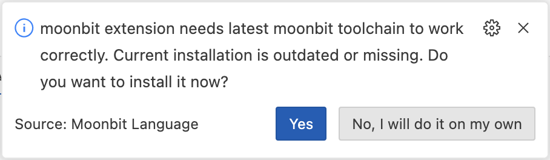

# weekly 2024-03-25
## Build System Updates

1. Added support for expect testing.
   a. Use `moon new` to create a new MoonBit project.
   b. Write in `lib/hello.mbt`:

```moonbit
pub fn hello() -> String {
  "Hello, world!"
}

test {
  let buf = Buffer::make(10)
  buf.write_string(hello())
  buf.expect()?
}

```

c. Then run `moon test --update` or `moon test -u`:

```bash
$ moon test --update
expect test failed at lib/hello.mbt:8:3-8:15
Diff:
----
Hello, world!
----

Total tests: 1, passed: 0, failed: 1.

Auto updating expect tests and retesting ...

Total tests: 1, passed: 1, failed: 0.

```

d. Reopen the `lib/hello.mbt` file, and you can see that the test result has been promoted to the source code.

```moonbit
pub fn hello() -> String {
  "Hello, world!"
}

test {
  let buf = Buffer::make(10)
  buf.write_string(hello())
  buf.expect(~content="Hello, world!")?
  //         ^~~~~~~~~~~~~~~~~~~~~~~~ Test result updated
}

```

1. `moon run` no longer supports the `output-wat` option.

## MoonBit Update

1. Supported the backend code generation for multi-argument constructors. Now, when constructing a value of a generic type, if the generic parameter is a tuple, parentheses must be used to first explicitly construct a tuple, as in:

   ```moonbit
   enum A[X] {
     A(X)
   }

   fn init {
     // Error, expecting 1 arg, getting 2
     A::A(1, 2) |> ignore

     // Ok
     A::A((1, 2)) |> ignore
   }

   ```

   Multi-argument constructors unbox the parameters, which can improve the performance of the generated code and also allow programmers to have more control over the data's memory layout.

2. Adjusted the `lsl`, `lsr`, `asr` methods of `Int64`, now the shift parameter is no longer `Int64`, but `Int`. Also adjusted the `clz`, `ctz`, `popcnt` methods, now their return type is no longer `Int64`, but `Int`. This change helps us generate more efficient code on platforms that do not support native `Int64`.

## IDE Update

1. Supported renaming of labeled arguments.
2. The MoonBit VSCode plugin provides support for automatically installing or upgrading the MoonBit toolchain.

a. First, updating the plugin. If Moon is not installed or outdated, a notification will pop up to you to install or upgrade your MoonBit toolchain.



b. Click "yes" to start the automatic installation task. When the task is completed, your MoonBit toolchain will be installed or upgraded to the latested version.


