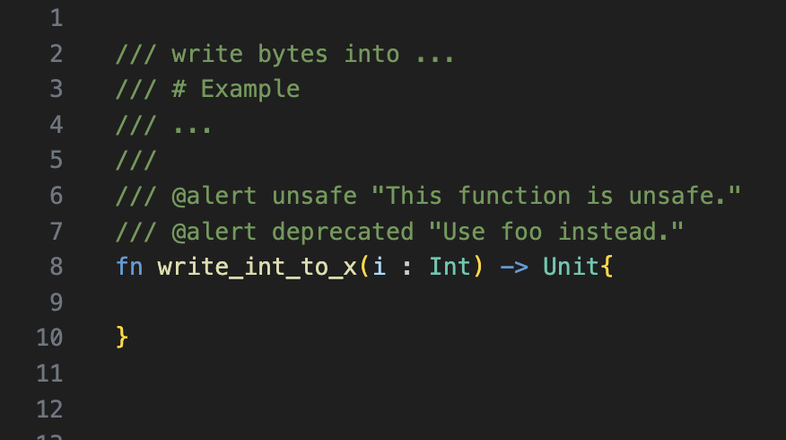

# weekly 2024-04-01
## MoonBit Update

- `inspect` function added for the `Show` interface in expect testing with the following signature:

```moonbit
pub fn inspect(
  obj : Show,
  ~content : String = "",
  ~loc : SourceLoc = _,
  ~args_loc : ArgsLoc = _) -> Result[Unit, String]

```

⚠️ This API is currently unstable and may be changed to the `expect` function in the future.

For example, in the following code:

```moonbit
fn add(x: Int, y: Int) -> Int {
  x + y
}

test {
  inspect(add(1, 2))?
}

test {
  (add(3, 4) |> inspect)?
}

```

After executing `moon test -u`, the file is automatically updated to:

```moonbit
fn add(x: Int, y: Int) -> Int {
  x + y
}

test {
  inspect(add(1, 2), ~content="3")?
}

test {
  (add(3, 4) |> inspect(~content="7"))?
}

```

- Move compiler builtins to `moonbitlang/core`

Some fundamental MoonBit definitions, previously maintained inside the MoonBit compiler, is now migrated to `moonbitlang/core`

- Alert pragma supported

MoonBit now supports writing multiple pragma in the top-level doc comments. All pragma start with `@` and occupy a line by themselves.



Currently, function and method alert pragma are supported. If functions or methods marked with alert are used, a warning will be generated. This mechanism can be used to mark functions as deprecated or unsafe. The format for alert pragmas is `@alert id "explanation string"`, where id can be any identifier.


- Supported marking intrinsics in pragmas. For example, after the following code in the standard library was marked as intrinsic, the JavaScript backend would use the `String(..)` function to convert floating-point numbers into strings. We will add support for more functions as intrinsics in the future.

```java
/// @intrinsic %f64.to_string
pub fn to_string(self : Double) -> String {
  double_to_string(self)
}

```

- Added `ArgsLoc`, used to automatically insert the position of each argument in the source code.

```moonbit
fn test_args_loc(a: Int, b: Int, ~args_loc : ArgsLoc = _) -> Unit {
  println(args_loc)
}

fn init {
  test_args_loc(1, 2)
  // Output: [Some(path/to/xx.mbt:6:17-6:18), Some(path/to/xx.mbt:6:20-6:21), None]
}

```

- Improved the completeness check for pattern matching.
- Improved moonfmt

  - Adjusted the print format for function for loops; semicolons are no longer printed in special cases.
  - For cases of poor readability due to nested if/match, extra parentheses were added after formatting. The effects before and after formatting are as follows:

  


- Enhanced the performance and size of the generated code.
  - Introduced optimizations to eliminate local aliases, thus avoiding the generation of unnecessary local variables.
  - Introduced constant propagation optimizations.
  - Optimized the type declaration part of the generated wasm code, reducing redundant type declarations.
- Adjusted string encoding to UTF-16.

# IDE Update

- The VSCode plugin supported installing or updating the MoonBit toolchain.


# Build System Update

- Supported custom function export names in the `moon.pkg.json` file using the `["link"][BACKEND]["exports"]` field, and by default, not all `pub` functions are exported anymore. It is now required to explicitly specify them in the `exports`. Additionally, linking non-main packages through the `link` field is now supported.

For example, creating a new project with `moon new hello` results in the following directory structure:

```moonbit
.
├── README.md
├── lib
│   ├── hello.mbt
│   ├── hello_test.mbt
│   └── moon.pkg.json
├── main
│   ├── main.mbt
│   └── moon.pkg.json
└── moon.mod.json

```

In the past, executing `moon build` would only generate a wasm file for the main package. Now, the `link` field in `moon.pkg.json` supports generating wasm files for non-main packages. The `link` field can be a boolean value:

```moonbit
{
  "link": true //  Indicates that the current package needs to be linked
}

```

Or an object, which allows setting link options for different backends like `wasm` or `wasm-gc`. Currently, only the `exports` option is supported. `Exports` is an array of strings that includes the functions to be exported and their names:

```moonbit
{
  "link": {
    "wasm": {
      "exports": [
        "hello" // This exports the function hello as hello
      ]
    },
    "wasm-gc": {
      "exports": [
        "hello:hello_wasm_gc" // This exports the function hello as hello_wasm_gc
      ]
    }
  }
}

```

If the content of `lib/moon.pkg.json` is modified to:

```moonbit
{
  "link": {
    "wasm": {
      "exports": [
        "hello"
      ]
    }
  }
}

```

Then executing `moon build --output-wat`, the output in `target/wasm/release/build/lib/lib.wat` will include the following content:

```moonbit
(func $username/hello/lib.hello.fn/1 (export "hello") (result i32)
 (i32.const 10000))

```

Where `(export "hello")` indicates the configuration took effect.
