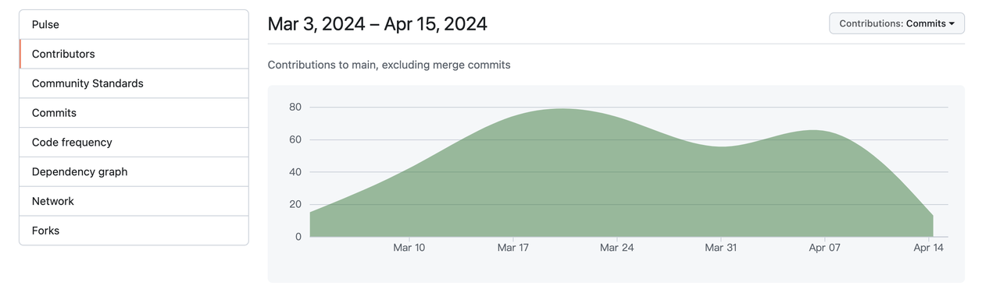
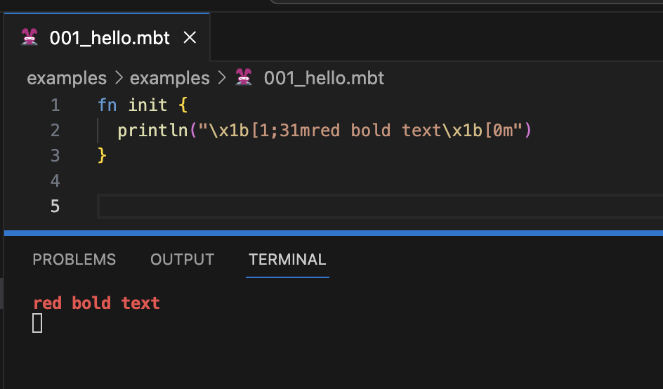
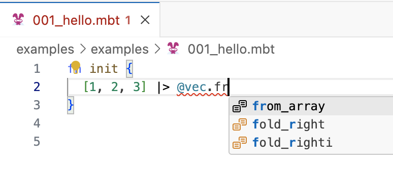
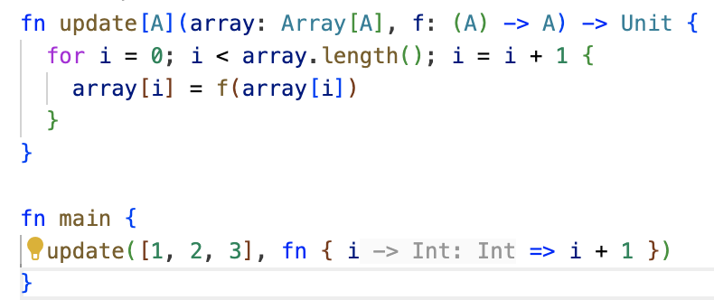
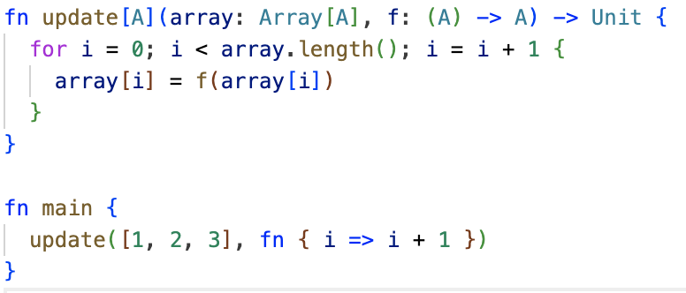

# weekly 2024-04-15
MoonBit is a Rust-like language (with GC support) and toolchain optimized for WebAssembly experience. This is our recent update:

## Core Update

We have received 221 Repositories to MoonBit [core](https://github.com/moonbitlang/core) since its open source in March, with 26 excellent contributors contributing about 10,000 lines of code of high quality. Thanks a lot for your passion and support for MoonBit!



## Language Update

- Expanded array patterns in pattern matching.

  - Support the `vec` type in the standard library.
  - Support for generic types `[a, .., b]`.

  ```moonbit
  fn main {
    let xs = @vec.from_array([1, 2, 3])
    match xs {
      [1, .., 3] => { println("ok")}
      _ => println("not ok")
    }
    // Output: ok
  }
  ```

## IDE Update

- Changed the printing output of the online IDE from the Output channel to the terminal. Fixed the issue where the printing output was occasionally truncated in Firefox browsers. ANSI escape sequences can be used in browser code, for example:



- Support autocompletion in the form of `x |> @pkg.`



- Disabled inlay hint for matrix functions.

Before



After



## Toolchain Update

- Added (experimental) test coverage tools. (\*Windows is not supported at the moment)

  - Added `-enable-coverage` option to `moon test` for enabling coverage during runtime.
  - Added `moon coverage` command for reading and processing coverage data.
    - After testing, `moon coverage report -f <format>` can be used to output coverage data. Supported output formats include:
      - bisect (default output format of OCaml Bisect tool)
      - html (output result webpage)
      - coveralls (JSON format suitable for CodeCov and Coveralls tool upload)
      - summary (output summary in the terminal)
        More functionalities can be viewed through `moon coverage report -h`.
    - `moon coverage clean` command can be used to clean up previous coverage data output.

- The build system has added the `moon info` command for generating public interface files of software packages. (\*Windows is not supported at the moment)
  Example:

  ````moonbit
  $ moon new hello
  $ cd hello
  $ moon info
  $ cat lib/lib.mbti
  package username/hello/lib

      // Values
      fn hello() -> String

      // Types and methods

      // Traits

      // Extension Methods
      ```

  ````

- Fixed the issue where the annotation was misaligned caused by trailing commas in `moonfmt`.
- Fixed the issue where file paths cannot contain spaces in `moon`.
