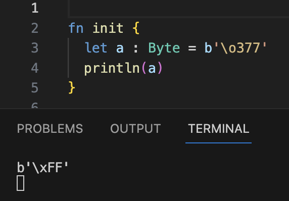

# weekly 2024-04-22
MoonBit is a Rust-like language (with GC support) and toolchain optimized for WebAssembly experience. This is our recent update:

## Language Update

- The standard library has added the `Iter` type, which efficiently accesses elements in a container and optimizes the access process into a loop. Here's an example of how to use it:

```moonbit
test "iter" {
  let sum = Iter::[1, 2, 3, 4, 5, 6]
  .filter(fn { x => x % 2 == 1 })
  .take(2)
  .map(fn { x => x * x})
  .reduce(fn (x, y) { x + y }, 0)
  inspect(sum, content="10")?
}
```

- A VecView type has been added to the standard library, and you can obtain its `VecView[T]` for values of type `Vec[T]` using the following method.

```moonbit
test "view" {
  let v = Vec::[1, 2, 3, 4, 5]
  let vv1 = v[..]
  let vv2 = v[1..]
  let vv3 = v[..4]
  let vv4 = v[1..4]
  inspect(vv1, content="VecView::[1, 2, 3, 4, 5]")?
  inspect(vv2, content="VecView::[2, 3, 4, 5]")?
  inspect(vv3, content="VecView::[1, 2, 3, 4]")?
  inspect(vv4, content="VecView::[2, 3, 4]")?
}
```

- The array pattern supports the form `[a, .. as rest, b]`, where `rest` will be bound to a VecView.

```moonbit
test "view_pattern" {
    fn is_palindrome(s: VecView[Int]) -> Bool {
    match s {
      [] => true
      [_] => true
      [x, .. as rest, y] => x == y && is_palindrome(rest)
     }
    }
    let v1 = Vec::[1, 2, 3, 4, 5]
    @assertion.assert_false(is_palindrome(v1[..]))?
    let v2 = Vec::[1, 2, 3, 2, 1]
    @assertion.assert_true(is_palindrome(v2[..]))?
}
```

- Allow the omission of the tilde `~` inside tags when calling tag parameters, for example:

```moonbit
inspect(1, content="1")
```

- Constructor now supports labelled arguments:

```moonbit
enum Tree[X] {
  Nil
  Branch(X, ~left : Tree[X], ~right : Tree[X])
}

fn leftmost[X](self : Tree[X]) -> Option[X] {
  loop self {
    Nil => None
    // use `label=pattern` to match labelled arguments of constructor
    Branch(top, left=Nil, right=Nil) => Some(top)
    // `label=label` can be abbreviated as `~label`
    Branch(_, left=Nil, ~right) => continue right
    // use `..` to ignore all remaining labelled arguments
    Branch(_, ~left, ..) => continue left
  }
}

fn init {
  // syntax for creating constructor with labelled arguments is the same as callig labelled function
  let t: Tree[Int] = Branch(0, right=Nil, left=Branch(1, left=Nil, right=Nil))
  println(t.leftmost()) // `Some(1)`
}
```

- The default value of optional parameters can depend on preceding parameters, for example:

```moonbit
fn f(~x: Int = 1, ~y: Int = x) -> Int {
  x + y
}
```

- Byte literals support octal escapes.



## IDE Update

- IDE supports test codelens for local environments and automatic updates for expect tests.


- Fixed an issue where the online IDE couldn't find core on Windows.

- Support for identifying `test_import` and `*_test.mbt` files.

## Toolchain Update

- moonfmt

  - Fixed an issue where escape sequences in `String` and `Char` literals were not formatted correctly.
  - Adjusted formatting for `{ ..record }`

- `moon info` and `moon coverage` now support Windows.

- `moon info` supports shortening type names when it doesn't cause ambiguity, making the generated results cleaner. - Hide the builtin package name prefix when there is no type definition with the same name. - Use the last part of the package name instead of the full package name when there is no ambiguity.
  Before:

```moonbit
package moonbitlang/core/map

// -- snip --

type Map
fn Map::debug_write[K : @moonbitlang/core/builtin.Debug, V : @moonbitlang/core/builtin.Debug](Map[K, V], @moonbitlang/core/builtin.Buffer) -> Unit
fn Map::keys_set[K : @moonbitlang/core/builtin.Compare + @moonbitlang/core/builtin.Eq, V](Map[K, V]) -> @moonbitlang/core/immutable_set.ImmutableSet[K]
fn Map::lookup[K : @moonbitlang/core/builtin.Compare + @moonbitlang/core/builtin.Eq, V](Map[K, V], K) -> Option[V]
fn Map::to_vec[K, V](Map[K, V]) -> @moonbitlang/core/vec.Vec[Tuple[K, V]]
```

After:

```moonbit
package moonbitlang/core/map

alias @moonbitlang/core/immutable_set as @immutable_set
alias @moonbitlang/core/vec as @vec

// -- snip --

type Map
fn Map::debug_write[K : Debug, V : Debug](Map[K, V], Buffer) -> Unit
fn Map::keys_set[K : Compare + Eq, V](Map[K, V]) -> @immutable_set.ImmutableSet[K]
fn Map::lookup[K : Compare + Eq, V](Map[K, V], K) -> Option[V]
fn Map::to_vec[K, V](Map[K, V]) -> @vec.Vec[Tuple[K, V]]
```

## Build System Update

- `moon test` adds options related to test filtering:

```Bash
-p, --package <PACKAGE_NAME>  Run test in the specified package
-f, --file <FILE>             Run test in the specified file, only valid when --package is specified
-i, --index <INDEX>           Run the index-nth test in the specified file, only valid when --file is specified

```

Command example: `moon test -p username/hello/A -f` `hello.mbt -i 0` (runs the `0`th test block in the `hello.mbt` file in the `username/hello/A package`); `-f` and `-i` are effective only when specified with `-p`; if `-f` is not specified, all tests in the package specified by `-p` will be run, and if `-i` is not specified, all tests in the file specified by `-f` will be run.

- `moon check|build|test` adds the `-sort-input` option for generating stable build orders.

- The `~content=` generated by expect tests omits the `~` and is changed to `content=`.
