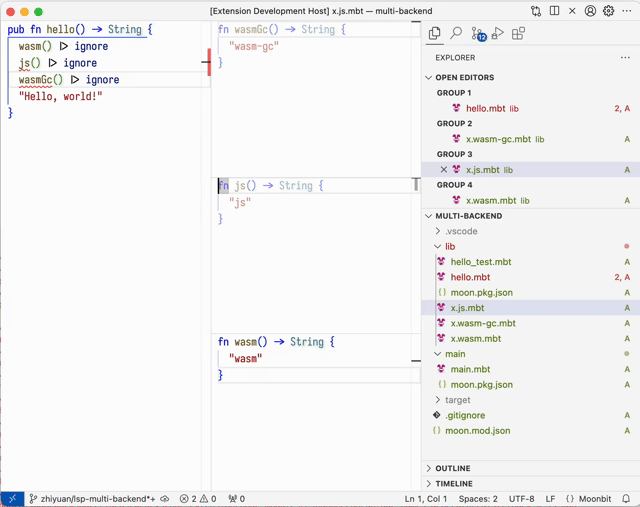

# weekly 2024-04-30
MoonBit is a Rust-like language (with GC support) and toolchain optimized for WebAssembly experience. This is our recent update:

# MoonBit Update

- **MoonBit now supports JavaScript backend, up to 25x faster than native JS and 8x faster than Json5!**

Read our latest blog and see how we did it: [https://www.moonbitlang.com/blog/js-support](https://www.moonbitlang.com/blog/js-support)

Play with this example and try MoonBit JS now: [https://github.com/moonbit-community/benchmark-202404/tree/master/bench_json5](https://github.com/moonbit-community/benchmark-202404/tree/master/bench_json)

- **MoonBit now allows passing callback functions to FFI.** However, the parameters and return types of callback functions are currently limited to simple types such as `Int`. Example:

```moonbit
// Example: passing a callback to external code
fn set_callback(f : () -> Int) = "ffi" "set_callback"

// Example
fn use_callback() -> Int = "ffi" "use_callback"

test {
  let i = { val : 0 }
  set_callback(fn () {
    i.val += 1
    i.val
  })
  inspect(use_callback(), content="1")?
  inspect(use_callback(), content="2")?
  inspect(use_callback(), content="3")?
  inspect(use_callback(), content="4")?
}
```

```jsx
let f

export default {
  // Necessary external interface: converting a closure to a JS function. Implementation varies in different runtimes depending on the language.
  'moonbit:ffi': {
    make_closure: (funcref, context) => funcref.bind(null, context)
  },
  // Example
  ffi: {
    set_callback: (func) => {
      f = func
    }, // Set callback function
    use_callback: () => f() // Use callback function
  }
}
```

- Modified the syntax for explicitly implementing a trait (extension method), allowing explicitly specifying which type is implementing the trait.

```moonbit
// Provide a default implementation for method method of trait Trait
impl Trait with method(...) { ... }

// Implement method method of trait Trait for type Type
impl Trait for Type with method(...) { ... }

// With type parameters
impl[X] Trait for Array[X] with method(...) { ... }
```

Compared to the previous syntax `fn Trait::method(...)`, the new syntax allows explicit specification of the implementing type, providing richer and clearer signature information. Since the type is specified, the compiler can automatically infer the method's parameter and return types, eliminating the need for manual annotations:

```moonbit
trait MyTrait {
  f(Self) -> Option[Int]
}

// No need to annotate `self` and the return type
impl MyTrait for Int with f(self) {
  // Compiler can automatically infer that the return type is `Option[Int]`
  Some(self)
}
```

- Support Bytes literals.

Bytes literals `b"..."` will convert the ASCII string inside the double quotes to the Bytes type, with support for hexadecimal and octal escapes within the string.

```moonbit
 let b1 : Bytes = b"ASCII"
 let b2 : Bytes = b"\xFF\o000"
```

- Fixed the issue where `{ x }` is too ambiguous.

Now `{ x }` will be parsed as a struct with only one x field, equivalent to `{ x: x }`. For this potentially confusing syntax, the compiler will issue a warning.

# IDE Update

- Added the option `moonbit.autoUpdate` in plugins to control whether to enable automatic update prompts.
- **Plugins now support multi-backend development:**
  - Users can choose different backends within VSCode.
  - The code diff visibility decreases for non-current backends.



# Build System Update

- Support for backend-specific files, where these files have extensions named with `.wasm|wasm-gc|js.mbt`, for example: `foo.wasm.mbt`, `foo.wasm-gc.mbt`, `foo.js.mbt`. For instance, in `moon build --target js`, only regular `.mbt` files and `.js.mbt` files will participate in the build. Accordingly, modifications have been made to `moon check|build|test` and the linking process in `moonbitlang/core` to be backend-specific.
- In the `moon.pkg.json` file, a new `format` field is added to `["link"]["js"]`, used to specify the output JavaScript module format. Possible values are `esm|cjs|iife`, with the default being `esm`.
  - In `esm` mode, `export { x as y }` statements are used for exporting.
  - In `cjs` mode, `exports.y = x` is used for exporting.
  - In `iife` mode, `globalThis.y = x` is used for exporting.

Example `moon.pkg.json`:

```moonbit
{
  "link": {
    "js": {
      "exports": [
        "hello"
      ],
      "format": "cjs"
    }
  }
}

```

- `moon test -u` now supports automatically updating multiple `inspect` functions within test blocks, and adds the `-limit` option to restrict the maximum number of iterations for automatic updates.

# Toolchain Update

- `moonrun` has switched from wasmtime to V8, now supporting the wasm-gc backend.

```bash
moon new hello
cd hello
moon run main --target wasm-gc
```

- `moon info` update
  - Support grouping methods to facilitate comparison between implementations of different data structures.
  - Support tagged parameters, default parameters, and automatic parameter filling.

```moonbit
type Map
impl Map {
 debug_write[K : Debug, V : Debug](Self[K, V], Buffer) -> Unit
 elems[K, V](Self[K, V]) -> List[V]
 fold[K, V, T](Self[K, V], (T, V) -> T, ~init : T) -> T
 from_array[K : Compare + Eq, V](Array[Tuple[K, V]]) -> Self[K, V]
 // ...
}
```
