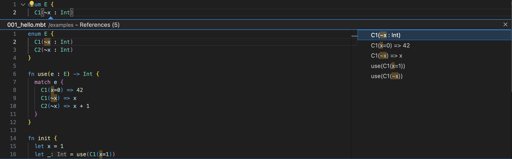

# weekly 2024-05-13

MoonBit is a Rust-like programming language (with GC support) and toolchain optimized for WebAssembly.

## Language Update

- **Support mutable fields in the payload of the constructor**, here is how to use it:
```moonbit
enum E {
  C(mut ~x : Int, mut ~y : Int)
} derive(Debug)


fn swap_xy(x : E) -> Unit {
  match x {
    // `~y` will bind to the value of the `y` field in the `C` before pattern matching.
    // When encountering a pattern like `C(..) as c`, the compiler will know that `c` must be the constructor,
    // so `c.x` and `c.y` can be directly accessed within the branch to access the fields of `C`.
    C(~y, ..) as c => {
      // `c.x` and `c.y` can be used to modify/read the latest values in `C`.
      c.y = c.x
      c.x = y
    }
  }
}

fn init {
  let e : E = C(x=1, y=2)
  debug(e) // C(x=1, y=2)
  swap_xy(e)
  debug(e) // C(x=2, y=1)
}
```
In this example, the `swap_xy` function swaps the values of the `x` and `y` fields of the constructor `C`, and this swap is done in-place without introducing additional memory allocation.

- **Array literals by default construct vectors.** Array literal syntax has been overloaded. Now, array literals can be used to construct `Vector`s and `Array`s, with the specific type determined by the context. If the type is ambiguous in the context, Vector is used by default, for example:
```moonbit
fn init {
  let v = [1, 2, 3]             // v has type @vec.Vec[Int]
  let a : Array[_] = [1, 2, 3]  // a has type Array[Int]
}
```
In the future update, `Array` will be `FixedArray`, `Vec` will be `Array`.

- Error messages now include error codes, for example:
```Bash
./vec/sort.mbt:68:16-68:23 [E4021] The value identifier minimum is unbound.
./vec/sort_by.mbt:90:16-90:23 [E4021] The value identifier minimum is unbound.
./vec/vec.mbt:962:37-962:50 [E4020] Package "iter" not found in the loaded packages.
./vec/vec.mbt:963:3-963:13 [E4024] The type/trait @iter.Iter is not found.
```

## IDE Update

- Support functionalities like gotodef/gotoref/rename for the labels of labeled fields in constructors, for example:


## Build System Update

- Support configuring the warn list and alert list at the package level.
  - Configuration in `moon.pkg.json` is as follows, where you can disable corresponding warns and alters during compilation. (Here, `2`, `alter_1`, and `alert_2` are respectively the compiler's predefined warn id for Unused variable and user-defined alert id.)
```JSON
{
  "warn_list": "-2",
  "alert_list": "-alert_1-alert_2"
}
```
  - `-` represents closing the corresponding id's warn and alter. Check the predefined warns with `moonc build-package -warn-help`.

- The default backend for `moon check|build|run|test` has been switched from `wasm` to `wasm-gc`

- The default execution mode for `moon test` has been changed from `release` to `debug`.

- `moon check|build|run|test` now supports automatic dependency installation without the need to manually execute `moon install`

- `moon doc --serve` now supports specifying the address and port.
```Shell
-b, --bind <BIND> [default: 127.0.0.1]
-p, --port <PORT> [default: 3000]
```
- Optimize moon size.

| Platform | Before | After |
| -------- | ------ | ------ |
| macOS arm64 | 7.3 MiB | 3.6 MiB |
| macOS x86_64 | 8.2 MiB | 4.1 MiB |
| Ubuntu x86_64 | 14.0 MiB | 9.6 MiB |
| Windows x86_64 | 9.4 MiB | 4.9 MiB |

## Toolchain Update

- `moonrun` now supports printing backtrace.
  Sample：
  Create a new project with `moon new hello`, and replace `main/main.mbt` with:
```moonbit
  fn bar() -> Unit {
  abort("")
}

fn foo() -> Unit {
  bar()
}

fn main {
  foo()
}
```
  Execute `moon run main --debug`, and you will see output similar to:
```moonbit
error: RuntimeError: unreachable
    at $username/hello/main.bar.fn/1 (wasm://wasm/6fe99e5e:wasm-function[3]:0xe6)
    at $username/hello/main.foo.fn/2 (wasm://wasm/6fe99e5e:wasm-function[4]:0xea)
    at *init*/3 (wasm://wasm/6fe99e5e:wasm-function[5]:0xef)
    at <anonymous>:9:22
```