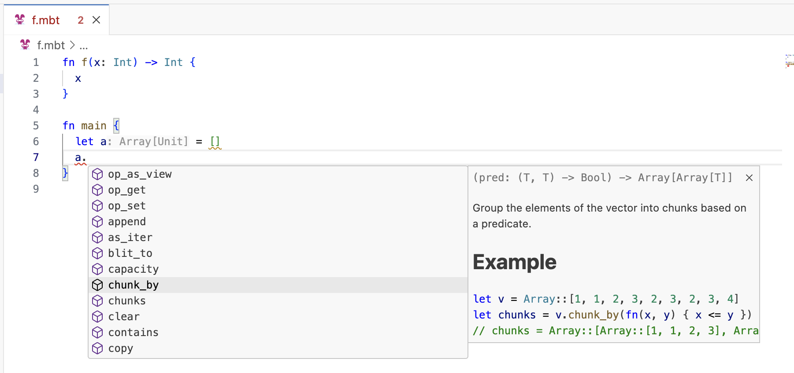

# weekly 2024-06-11

## Language Update
- **Wasm MVP**: Added reference counting support based on the Perceus algorithm to the Wasm1 backend.

- **Syntax**: `throw`, `raise`, `try`, and `catch` are reserved as keywords in preparation for the upcoming error handling mechanism.

- **Core**: `List` and `sorted_map` have been moved to `core/immut`
  - `List` has been moved to the `core/immut/list` package and is no longer supported as a built-in type.
  ```moonbit
  let a = @immut/list.List::Cons(1, Cons(2, Nil))
  ```
  - `sorted_map` has been moved to the `core/immut/sorted_map` package.

- **Core**: JSON API has been optimized for better performance and to align with the new Core API.
  - New type definitions:
```moonbit
// Types and methods
pub enum JsonValue {
  Null
  // Previously Boolean(Bool)
  True
  False
  Number(Double)
  String(String)
  Array(Array[JsonValue])
  Object(Map[String, JsonValue]) // Previously @map.Map
}
```

- **JS**: Optimized `Int64` performance
  - On the JS backend, `Int64` now compiles to two `Int` values, addressing the previous performance issues with compiling to `BigInt`. Additionally, the runtime implementation of `Int64` in JS has been moved to the core standard library to facilitate open-source community review.

## Build System Update
- For moon.mod.json and moon.pkg.json, comments are supported when developing, but comments are not allowed when publishing (only standard JSON format is supported).

## IDE Update
- **LSP**: Function completion now displays parameter names.
