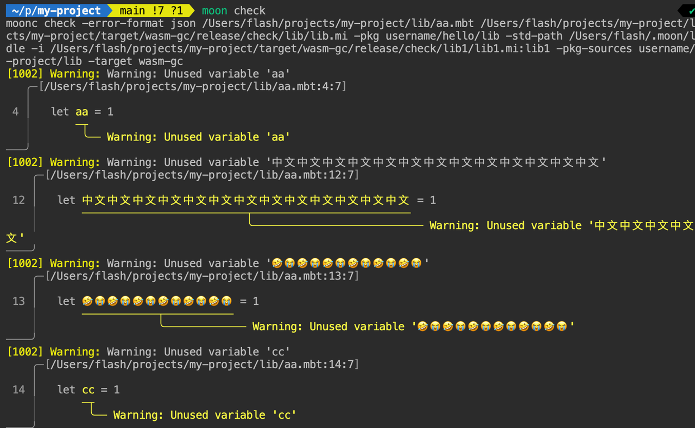

# weekly 2024-06-24

## Language Update

- **Support 32-bit unsigned integers**

  ```moonbit
  let num = 100U // Literal for 32-bit unsigned integers requires the 'U' suffix
  ```

- **WASM Backend Export Improvements**

  When exporting functions with a return type of Unit in the WASM backend, the exported function previously had a type of `(result i32)`. Now, the MoonBit compiler will automatically generate and export a wrapper function with no return value.

- **moonbitlang/core API Consistency Adjustments**
  - Unified `forall`/`exist` and `all`/`any` to `all`/`any`
  - Unified `contains` and `member` to `contains`

## IDE Updates

- **Bug Fix**

  Fixed a bug where the type prefix would be lost when renaming methods.

- **Enhancement**

  Added autocomplete functionality for match clauses of `try ... catch ...` expressions.

## Build System Updates

- **Diagnostic Information Rendering**

  Added an experimental feature for rendering diagnostic information. This can be enabled by setting the environment variable `MOON_RENDR=1`.

  

- **Command Changes**

  Changed the `moon bench` command to `moon generate-build-matrix`. The `bench` subcommand will be used for future purposes.
