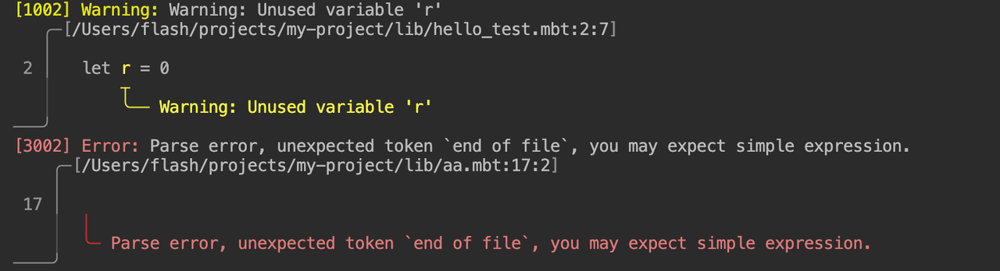

# weekly 2024-07-08

## Language Update

- **[Breaking change]** Modified array slice syntax from `arr[start..end]` to `arr[start:end]` similar to Python. This change is made to avoid syntax conflicts with the upcoming cascade method call `x..f()`. The old syntax will be deprecated soon.

- **[Breaking change on wasm backend]** Code in `fn init` is now compiled into the start section.
Previous versions compiled code from both `fn init` and `fn main` into a special function exported as "_start", therefore, host environments needed to call "_start" for initialization and execution of the `main` function.
The new version uses the wasm standard's start section to execute `fn init` during module loading, eliminating the need to call "_start" for `fn init`. "_start" is only necessary when executing `main`.

- **[Breaking change]** `test block` no longer returns `Result` type results.
Error handling mechanisms are now used within test blocks to handle test failures. The standard library's `inspect` function and helpers like `@test.eq` from the `@test` package are encouraged for writing tests, for example:

```moonbit
test "unwrap should return value on Some" {
  let some : Int? = Some(42)
  inspect(some, content="Some(42)")!
  @test.eq(some.unwrap(), 42)!
}
```

- Supports using `@pkg.C` to access constructors across packages. For example, if `@pkgA` contains the following declaration:

```moonbit
// pkgA
pub enum E1 { C1 }
```

Now, in another package, `E1`'s constructor `C1` can be directly used, for instance:

```moonbit
// pkgB
fn main {
  debug(@pkgA.C1)
}
```

In the same package, encountering duplicate public constructors will result in an error, for example:

```moonbit
pub enum E1 {
  C1
}

pub enum E2 {
  C1
  ^^ ------ There can be at most one public constructor with name C1.
}
```

## Core Update

- Migrated to a new error handling mechanism.

- Migrated to unsigned integers, removed old `compare_u`, `div_u`, `mod_u` functions for `Int` and `Int64` types; API adjustments include:
  - `Int32.trunc_double_u`, `Int64.trunc_double_u`
  changed to `UInt.trunc_double`, `UInt64.trunc_double`.
  - `Int64::extend_i32_u` changed to `UInt64::extend_uint`.
  - `Double::convert_i32_u`, `Double::convert_i64_u`
  changed to `Double::convert_uint`, `Double::convert_uint64`.

## Build System Update

- `moon version --all` displays moonrun's version information:

```bash
$ moon version --all
moon 0.1.20240705 (0e8c10e 2024-07-05) ~/.moon/bin/moon
moonc v0.1.20240705+7fdd4a042 ~/.moon/bin/moonc
moonrun 0.1.20240703 (52ecf2a 2024-07-03) ~/.moon/bin/moonrun
```

- Modified `moon new` project creation to default the `license` field to empty.

- Diagnostics information rendering is now enabled by default.


## Toolchain Update

- VSCode plugin defaulted to installing the corresponding plugin version's toolchain, changed from always installing the latest version.
