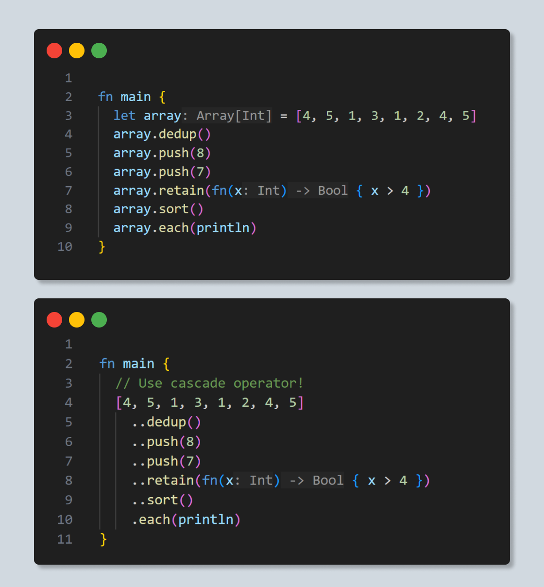
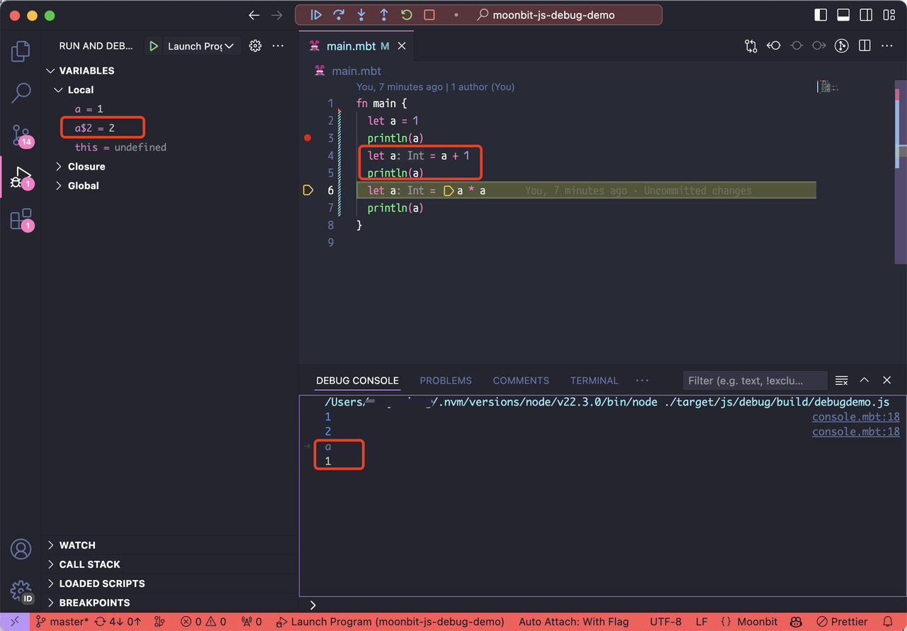
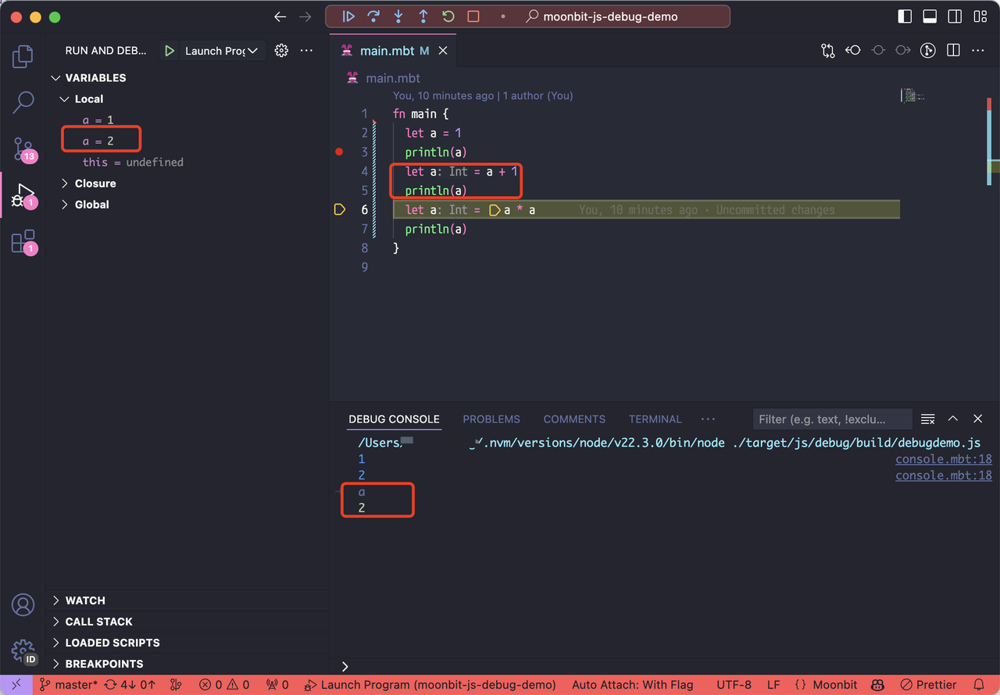

# weekly 2024-07-15

## Language Update

- **New syntax: Cascade Operator**

MoonBit introduces the ".." operator, allowing for chaining of mutable API calls while keeping the mutable API signatures clean (still returning Unit).

As illustrated, to avoid repetitive typing of `array` and to distinguish between immutable and mutable operations, we apply the cascade operator. For all methods within a type that return `Unit`, you can use `..` to chain these method calls without needing to change the return type of these methods. `array..push(5)..sort()` is equivalent to sequentially calling the mutable operations `array.push(5)` and `array.sort()`, returning `array`.



- **The `@package.Type::[...]` syntax has been removed.** It is recommended to use `@package.of([...])` as a replacement.

- **Sourcemap Improvement:** Debug mode sourcemaps generated with `--target js` now support the `names` table. This means that when debugging with devtools or VSCode, local variables will be displayed with their original names and can be accessed with their original names in the Debug console. This greatly improves the debugging experience.

Before:


After:


- **Spread Syntax for Arrays:** Arrays now support spread syntax, which allows any object expression that supports the `iter()` method to be expanded into a set of `Iter[_]` objects at the syntax level during array construction.

Array Expression:

```moonbit
let u1 = [1, 2, 3]
let u2 = [5, 6, 7]

fn main {
  let v = [..u1, 4, ..u2, 8]
  println(v)
}

// [1, 2, 3, 4, 5, 6, 7, 8]
```

  Map Expression (returns key-value pairs):

```moonbit
  let map : @sorted_map.T[Int,String] = @sorted_map.of([(3, "c"), (2, "b"), (1, "a")])

fn main {
  let v = [..map, (4, "d")]
  println(v)
}

// [(1, a), (2, b), (3, c), (4, d)]
```

- **C-like Bitwise Operators Support:** MoonBit now supports C-like bitwise operators (`^`, `&`, `|`, `<<`, `>>`) with the same precedence as in C. To avoid ambiguity, when expressions contain several operators with unclear precedence, the formatter will insert additional parentheses to improve readability.

- **Integer Literal Overloading:** For known types, literals for types other than `Int` can omit the special markers like `U`, `L`, etc:

```moonbit
fn main {
  let uint : UInt = 42
  let int64 : Int64 = 42
  let double : Double = 42
}
```

## Core Update

- The Hash Trait will be updated to the following form.

```moonbit
trait Hash {
   hash_iter(Self, Hasher) -> Unit
   hash(Self) -> Int
}

impl Hash with hash(self) {
   let hasher = Hasher::new()
   hasher.hash_iter(self)
   hasher.finalize()
}
```

## Build System Update

### Testing Mechanism Adjustment

Moon now automatically wraps source code files ending in `_bbtest.mbt` as black-box tests. Moon will automatically include the package as a dependency when compiling `*_bbtest.mbt`. We'll continue to adjust MoonBit's testing mechanism for a better developing and testing experience.

### Background

Currently, a MoonBit project can have three types of tests: white-box tests, black-box tests, and inline tests.

- **White-box tests:** Written in `*_test.mbt`, the build system packages and compiles the current package's `*.mbt` and `*_test.mbt` together. Therefore, `*_test.mbt` can access private members of the current package. These tests can use dependencies specified in the `import` and `test-import` fields in `moon.pkg.json`. `test-import` is only used in white-box tests and will not be packaged into the final build product.

- **Black-box tests:** Written in `*_bbtest.mbt`, the build system automatically includes the package as a dependency when compiling `*_bbtest.mbt`. `*_bbtest.mbt` can only access public members of its package, simulating the perspective of an external user using the package. These tests can use dependencies specified in the `*_bbtest.mbt` field in `moon.pkg.json` (as well as the package itself, which does not need to be explicitly listed in the `bbtest-import` field). `bbtest-import`  is only used in black-box tests and will not be packaged into the final build product.

- **Inline tests:** Can be written directly in `*.mbt`(note that `*.mbt` here excludes the above-mentioned `*_test.mbt`and `*_bbtest.mbt`)  and can access private members of the current package. These tests only use dependencies specified in the `import` field in `moon.pkg.json`.

### Future Test Naming Change

In the future, the current `*_test.mbt` (white-box tests) will be renamed to `*_wbtest.mbt`, and `*_bbtest.mbt` (black-box tests) will be renamed to `*_test.mbt` to encourage black-box tests.

## Toolchain Update

- **moonfmt improvements:**

  - When there are syntax errors in the source code, formatting will ignore the relevant code, allowing code formatting to still be executed.

  - When expressions contain several operators with unclear precedence, the formatter will insert additional parentheses to improve readability.

- MoonBit IDE added support for black-box tests (`*_bbtest.mbt`).
