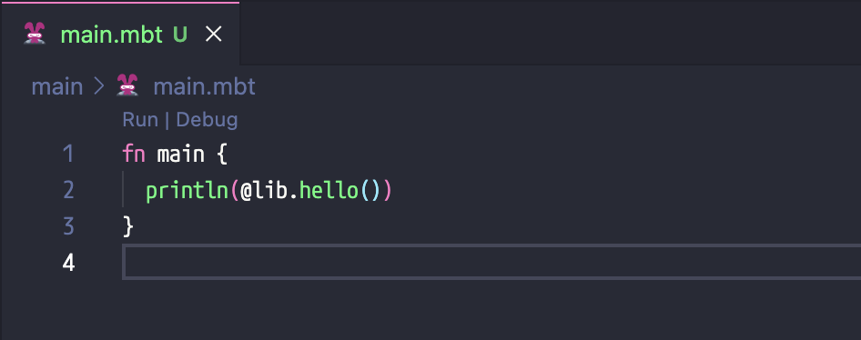
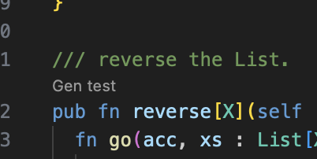
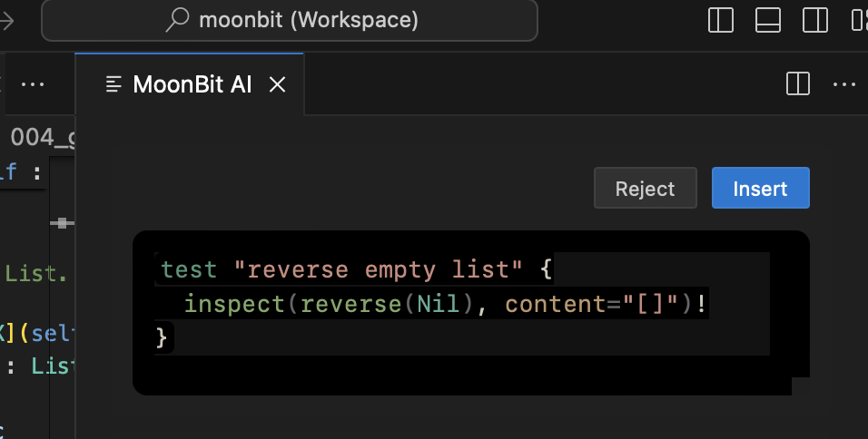

# weekly 2024-07-22

## Language Updates

### Breaking Changes

- **Error Handling Syntax**: The syntax for error handling has changed from `f(x)!` to `f!(x)`. This change facilitates IDE auto-completion, allowing the function name and `!` to be completed together and enabling special rendering for `f!`.

- **Local Functions**: If a local function can return an error type, it must be annotated. For example:

```moonbit
fn toplevel() -> Unit!String {
  fn local1() -> Unit!String { raise "err" }  // local function
  fn local2() -> _!_ { raise "err" }          // local function
  apply!(fn (_x) -> Int!String { raise "err" }, 42) |> ignore // anonymous function
}

fn apply(f: (Int) -> Int!String, x: Int) -> Int!String {
  f!(x)
}
```

Additionally, the `fn!` and `fn local!()` syntax can be used to indicate that a function might return an error and to let the compiler infer the error type. The former is used for lambda and anonymous functions, and the latter for regular local functions. For example:

```moonbit
fn toplevel() -> Unit!String {
  fn local!() { raise "err" }                    // local function
  apply!(fn! (_x) { raise "err" }, 42) |> ignore // anonymous function
  apply!(fn! { _ => raise "err" }, 42) |> ignore // lambda function
}
```

### Try Expression Enhancements

The `try` expression has been improved. The complete usage of the `try` expression is as follows:

```moonbit
fn test_try() -> Unit {
  fn f() -> Int!String {
    raise "err"
  }
  try {
    println("this is try body")
    f!()
  } except {
    err => println(err)
  } else {
    val => println(val)
  }
}
```

- The `except` keyword is used to handle errors returned by the try body.
- The `else` keyword is used to handle normal returns from the try body.

Simplified cases for the `try` expression:

- The `else` branch can be omitted if no handling of the return value is needed.
- The `try` body can be a simple expression.
- The `except` keyword can be omitted.

For example:

```moonbit
fn test_try() -> Result[Int, String] {
  fn f() -> Int!String {
    raise "err"
  }
  try Ok(f!()) { err => Err(err) }
}
```

### Integer Literal Overloading in Pattern Matching

Integer literal overloading has been added to pattern matching:

```moonbit
fn is_42(x : Double) -> Bool {
  match x {
    42 => true
    _ => false
  }
 }
```

### Upcoming Breaking Changes

- **Map Pattern Matching**: The semantics of `{ "key" : value }` in map patterns will be changed **this week**.

  Previously, in a map pattern, `value` was of type `Option[_]` and would match regardless of whether `"key"` existed.

  In the future, `{ "key": value }` will match only if `"key"` exists, and `value` will directly match the actual content of `"key"`.

  To match both the presence and absence of `"key"`, use the new syntax `{ "key"? : value_or_none }`, where `value_or_none` is of type `Option[_]`.

- **Trait Implementation Syntax**: The old syntax for explicit trait implementation `fn Trait::method(...)` will be removed this week. Existing code should use the `impl Trait for SelfType with method(...)` syntax. The `fn Trait::method(...)` syntax will be repurposed for defining methods on trait object types in the future.

## IDE Updates

- **Run | Debug Codelens for the main function**: The main function will now have a Run | Debug Codelens for quick execution and debugging. Currently, quick debugging only supports the JavaScript backend.



- **AI-Generated Tests for Top-Level Functions**: Top-level functions now support generating tests through AI via Codelens. * Please note that this feature is still under development and may not be stable.

  1. Click the "Gen test" button.

  

  2. A new window will appear on the right side, displaying the generated test.

  

  3. Click "Reject" to remove unwanted tests, or "Insert" to add the test into the source file.

## Core Updates

- **`Show` Trait Redefinition**: The `Show` trait has been redefined for more accurate behavior. The new definition of the `Show` trait is as follows:

```moonbit
pub trait Show {
  // The `output` function is for implementing `Show` for composite types.
  // It writes a string representation of `Self` to a `Logger`.
  output(Self, Logger) -> Unit
  // The `to_string` method is for `Show` users.
  // It can be used for string interpolation and `println`.
  // `to_string` has a default implementation using `output`.
  // Some types, like `String`, will override `to_string` to modify its behavior.
  to_string(Self) -> String
}
```

  The new `Show` resolves the incorrect behavior of `String`. Previously, if a composite type contained a `String`, the `Show` implementation would not escape this `String`, leading to incorrect results. Conversely, `String` used directly in string interpolation and `println` should not be escaped. The new `Show` definition and its core implementation address both needs.

  For `Show` implementers, please keep in mind:

- Implement the `output` method, not the `to_string` method.

- When recursively calling the `Show` implementation of substructures (e.g., struct fields), use `Show::output(..., logger)` instead of `to_string`.

- The default implementation of `Show::to_string` is not a method, so it cannot be called with a dot. To support `.to_string()` syntax, add a helper definition like this:

```moonbit
pub fn to_string(self: ...) -> String {
  Show::to_string(self)
}
```

- **Upcoming Breaking Change: Deprecation of `Debug` Trait**: Following the redefinition of the `Show` trait, the functionality of the `Debug` trait is now completely covered by `Show`. Therefore, the `Debug` trait is deprecated and will be removed soon.

- **Data Structure Type Renaming**: Data structure type names have been changed to `T`. For example:

```moonbit
// old
// let m : @hashmap.HashMap[Int, Int] = @hashmap.new()

// new
let m : @hashmap.T[Int, Int] = @hashmap.new()
```

  The following data structures have been renamed to `T`:

- deque
- hashmap
- hashset
- immut/array
- immut/hashmap
- immut/hashset
- immut/list
- immut/priority_queue
- immut/sorted_map
- immut/sorted_set
- queue
- priorityqueue
- rational
- sorted_map
- sorted_set

## Build System Updates

- **Build Output Adjustment**: The build process output has been adjusted to only print a command if that command fails.

- **Target Specification for `moon check|build|test|bundle`**: Previously, the `--target` option only supported three choices: `wasm|wasm-gc|js`. Now it supports specifying multiple backends to run in parallel. The supported options have changed to `wasm|wasm-gc|js|all`, and they can be combined with commas. The `--serial` option changes the parallel execution of different backends to serial execution, but the same backend will still execute concurrently. For example:

  - `moon test --target all` runs tests for all backends.
  - `moon test --target js,wasm` runs tests for `js` and `wasm` backends.
  - `moon test --target js,wasm --serial` is equivalent to running `moon test --target js; moon test --target wasm` sequentially.

- **Memory Configuration in `moon.pkg.json`**: Added `heap-start-address` and `import-memory` configuration for `["link"]["wasm"|"wasm-gc"]` in `moon.pkg.json`:

```json
{
  "link": {
    "wasm": {
      "heap-start-address": 65536,
      "import-memory": {
        "module": "xxx",
        "name": "yyy"
      }
    }
  }
}
```

- **Default Protocol for `moon new`**: The default protocol for `moon new` has been changed to Apache-2.0.
