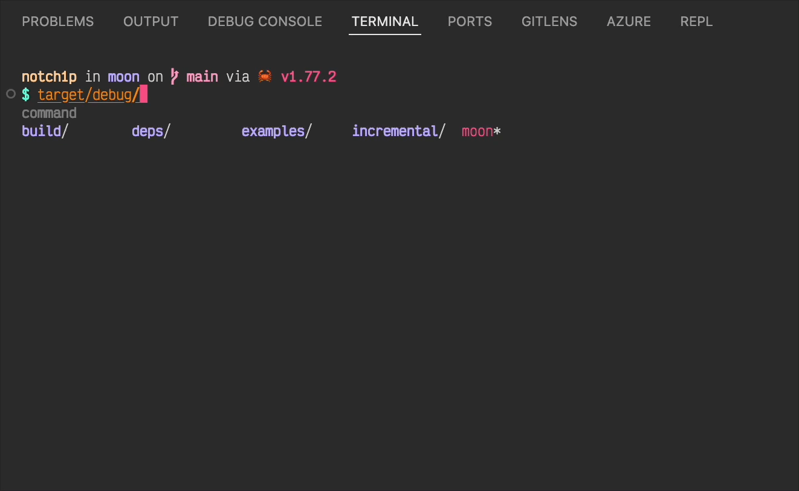

# weekly 2024-07-29

## Language Updates

- **Simplified Error Handling Syntax**: The syntax for capturing potential errors in function calls has been updated from `f(x)!!` to `f?(x)`, which returns a `Result` type.

```moonbit
fn div(x: Int, y: Int) -> Int!String {
  if y == 0 {
    raise "division by zero"
  }
  x / y
}

fn main {
  let a = div?(10, 2)
  println(a) // Ok(5)
}
```

- **JSON Literal Support**: Added support for JSON literals. Numbers, strings, arrays, and dictionary literals are now overloaded to provide a JSON type, which can be used for constructing/matching JSON when the type is expected.

```moonbit
fn json_process(x: @json.JsonValue) -> Double {
  match x {
    {
      "outer": {
        "middle": {
          "inner": [
            { "x": Number(x) },
            { "y": Number(y) }
          ]
        }
      }
    } => x + y
    _ => 0
  }
}

fn main {
  let x: @json.JsonValue = {
    "outer": { "middle": { "inner": [{ "x": 42 }, { "y": 24 }] } },
    "another_field": "string value",
  }
  json_process(x) |> println
}
```

- **Derive Hash Support**: Added `derive(Hash)` to automatically generate implementations of the `Hash` trait for types.

```moonbit
enum MyType {
  C1
  C2(Int)
} derive(Eq, Hash)

fn main {
  let m = {}..set(C1, 1)..set(C2(1), 2)..set(C2(2), 3)
  println(m[C1]) // Some(1)
  println(m[C2(1)]) // Some(2)
  println(m[C2(3)]) // None
}
```

- **JavaScript Backend Update**: Removed dependency on `TextDecoder` in generated code.

## Core Updates

- **Function Signature Changes**:

  - `Array::new_with_index` -> `Array::makei`
  - `FixedArray::new` / `FixedArray::new_with_index` -> `FixedArray::makei`
  - `FixedArray::empty` -> `FixedArray::new`

- **Removed `Debug` Trait**

## Build System Updates

- **Single .mbt File Support**: Now supports running a single `.mbt` file (not within a package). Usage: `moon run xx.mbt` (links to the standard library by default, requires a `main` function in `xx.mbt`).

- **Shell Completion**: Moon now supports shell completion.

  Example Usage: Zsh

  Zsh automatically reads all scripts under `$FPATH` on startup. You can place the completion script in any path under `$FPATH`.

  To manage more conveniently, create a new path for completions `$ZSH/completions` and add it to `$FPATH`.

  ```bash
  mkdir $ZSH/completions
  echo "FPATH+=$ZSH/completions" >> ~/.zshrc
  moon shell-completion > $ZSH/completions/_moon
  . ~/.zshrc # Reload to use, or omz reload
  ```

  To maintain portability, you can directly add the following line to `.zshrc`:

  ```bash
  eval "$(moon shell-completion --shell=zsh)"
  ```

  

  For the effect shown in the pic, you also need to install the `zsh-autocomplete` and `zsh-autosuggestions` plugins.

## Toolchain Updates

- **moonfmt Fixes**:

  Fixed an issue with array spread formatting adding braces.

  Adjusted parenthesis inference for pattern matching to avoid using wildcards.

- **VS Code Auto-test Support**: Now supports automatic test generation for functions, including black-box tests (ending in `_test.mbt`) and white-box tests (unit tests).

- **Run | Debug Buttons for .mbt**: Added support for single `.mbt` file Run | Debug buttons.
