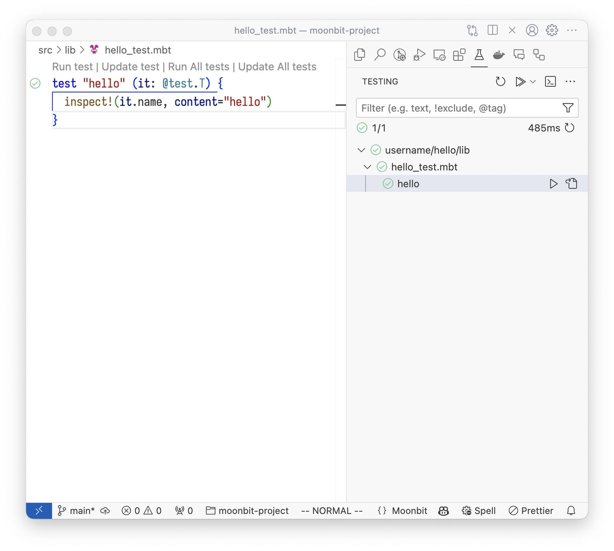
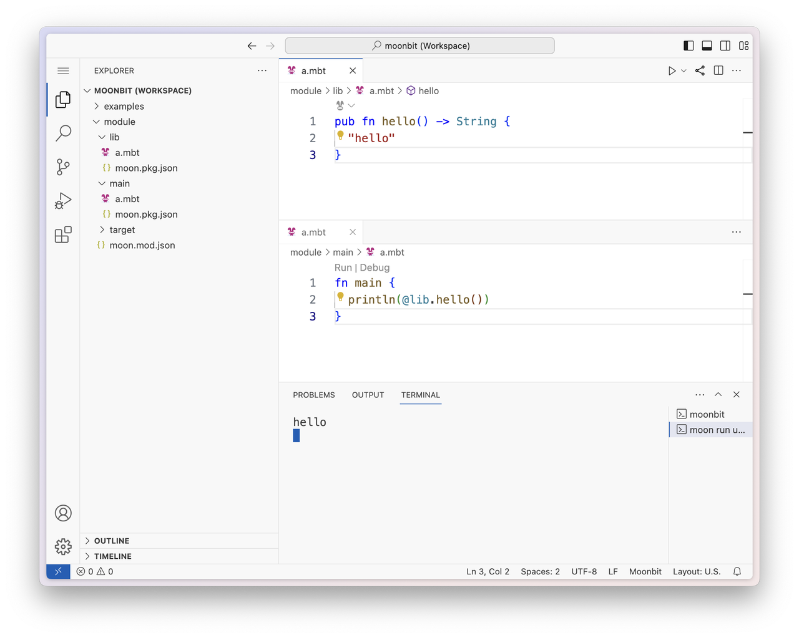

# weekly 2024-08-19

## Language Update

- **MoonBit Beta Preview**

MoonBit Beta Preview achieved major features of modern generic system, precise error handling, and efficient iterators, and an AI-powered toolchain, offering real use cases in cloud and edge computing. Read our [latest blog](https://www.moonbitlang.com/blog/beta-preview) for details.

- **Error Type Printing Improvement**

Error type printing now allows error types that implement `Show` to display more detailed information when used as `Error`. For example:

```typescript
type! MyErr String derive(Show)
fn f() -> Unit! { raise MyErr("err") }
fn main {
  println(f?()) // Output: Err(MyErr("err"))
}
```

- **Test Block Enhancement**

Added support for parameters in test blocks. The parameter type must be `@test.T`.

```moonbit
test "hello" (it: @test.T) {
  inspect!(it.name, content="hello")
}
```

## Build System Update

- Fixed an issue where `moon info` would write the wrong mbti file path when the `source` field was set in `moon.mod.json`.

## Core Update

- Added `last` function to `array` and `fixedarray`.

- Frequently used functions in the `test` package have been moved to `builtin`, and the old functions have been deprecated.

- Added `last`, `head`, and `intersperse` methods to `iter`.

## IDE Update

- MoonBit IDE now supports the VS Code Test Explorer.



- **Online IDE Multi-Package Editing**

The [online IDE](https://try.moonbitlang.com) now supports multi-package editing. You can develop MoonBit modules with package dependencies just like in a local environment. In this example, the `main` package depends on the `lib` package.



## Other Update

- MoonBit docs domain is now: [https://docs.moonbitlang.com](https://docs.moonbitlang.com).

- As MoonBit's language features stabilize and reaches the beta preview, update announcements will be adjusted to once every two weeks.
