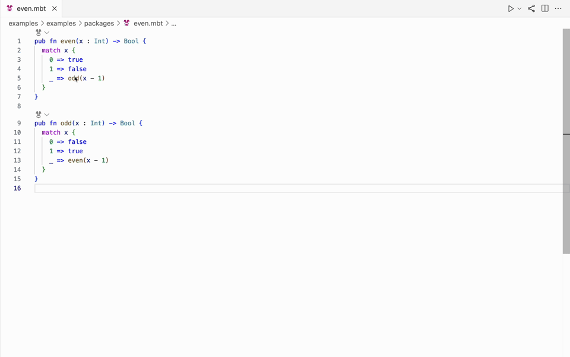
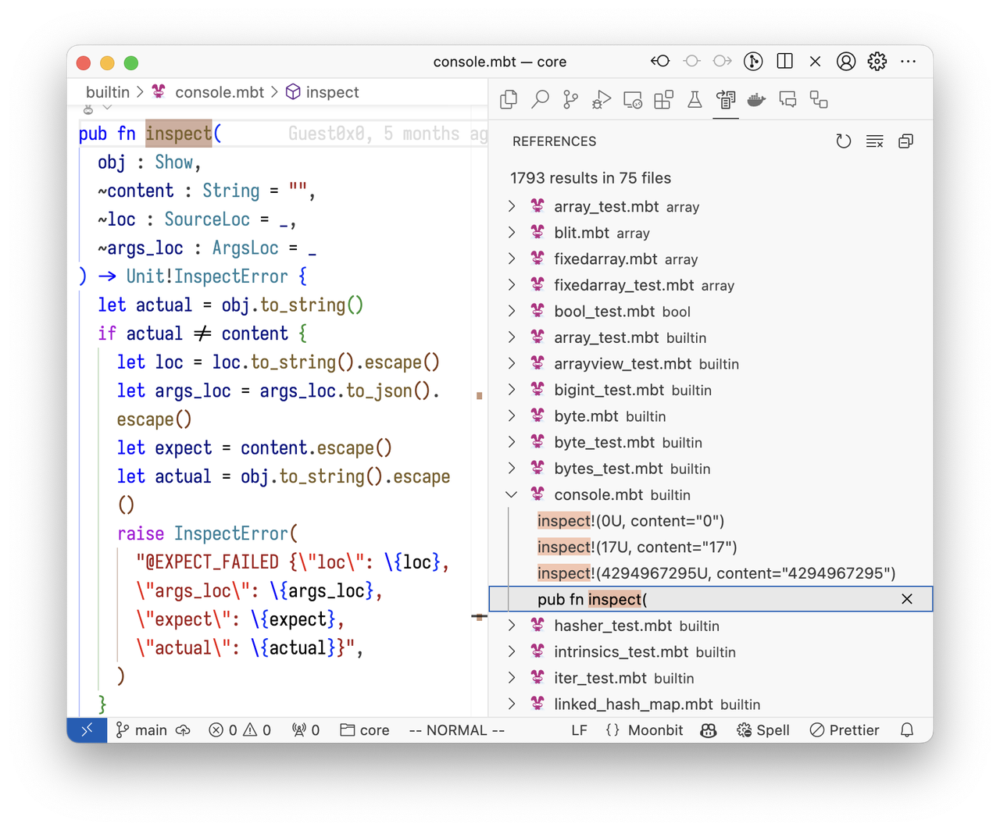
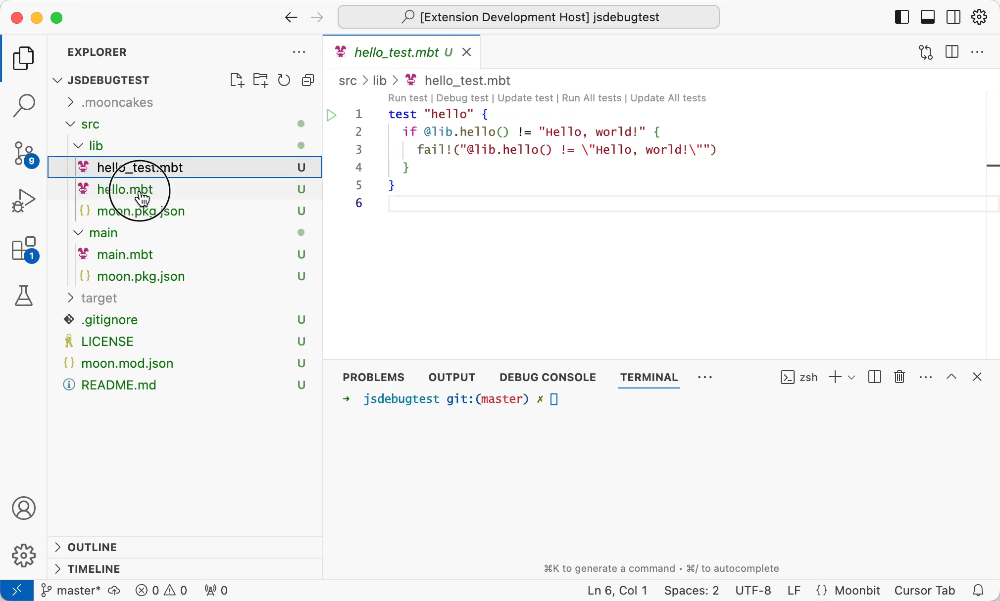

# Weekly 2024-09-03

## Language Updates

- **Breaking Change**: String interpolation syntax changed from `\()` to `\{}` where more expression types within `\{}` are supported. For example:

```moonbit
fn add(i: Int) -> Int {
  i + 1
}

fn main {
  println("\{add(2)}") // cannot invoke function in \() before
}
```

- **New Optional Argument**: Supported a new optional argument syntax where the compiler automatically inserts the `Some` constructor. Optional arguments of type `Option` are common, with a default value of `None`, and explicitly passed arguments use the `Some` constructor. The new syntax `~label? : T` simplifies this process:

```moonbit
fn image(~width?: Int, ~height?: Int, ~src: String) -> Unit
```

  Previously, we had to manually insert lots of `Some` constructors with the default value, which is quite troublesome.

```moonbit
image(width=Some(300), height=Some(300), src="img.png")
```

  Therefore, MoonBit introduced a new optional argument syntax `~label? : T`, which is quite similar to `?` in map pattern:

```moonbit
fn image(~width?: Int, ~height?: Int, ~src: String) -> Unit
```

At this point, `width` and `height` are optional arguments with a default value of `None`, and their types in the function body are `Int?`. When calling `image`, if you want to provide values for `width` and `height`, you don't need to manually insert `Some`; the compiler will automatically do it for you:

```moonbit
image(width=300, height=300, src="img.png")
```

If you need to pass an `Int?` type value directly to `image`, you can use the following syntax:

```moonbit
fn image_with_fixed_height(~width? : Int, ~src : String) -> Unit {
  // `~width?` is shorthand for `width?=width`
  image(~width?, height=300, src="img.png")
 }
```

- **Range Operators**: Added support for range operators `..<` (upper bound exclusive) and `..=` (upper bound inclusive) to simplify `for` loops:

```moonbit
fn main {
  for i in 1..<10 {
    println(i)
  }
}
```

Currently, the range operators only support the built-in types `Int`, `UInt`, `Int64`, and `UInt64`, and they can only be used within `for .. in` loops. In the future, these limitations may be relaxed.

- **`expr._` replaces `<expr>.0`**: Introduced `expr._` syntax for accessing newtypes. The previous syntax `<expr>.0` will be deprecated in the future, and currently, it will trigger a warning. The purpose of this change is to simplify the usage of `newtype` when wrapping a `struct` or tuple type by automatically forwarding field access to the underlying type, making it easier to use `newtype`.

- **Trait Implementation Consistency**: Implementing a `trait` now includes consistency checks to ensure that all `impl` signatures match. For example:

```moonbit
trait MyTrait {
  f1(Self) -> Unit
  f2(Self) -> Unit
}

// The signatures of these two `impl` blocks are inconsistent,
// with `f2` being more generic. However, because `impl` is used
// to implement a specific trait, this generality in `f2` is meaningless.
// All `impl` blocks for the same trait and type should have consistent signatures.
impl[X : Show] MyTrait for Array[X] with f1(self) { .. }
impl[X] MyTrait for Array[X] with f2(self) { ... }
```

## Core Update

- **Deprecate `xx_exn`**: Functions named `xx_exn` have been renamed to `unsafe_xx` (e.g., `unsafe_pop`, `unsafe_nth`, `unsafe_peek`).

- **Breaking Change**: Converting floating-point numbers to strings now conforms to the ECMAScript standard.

- **Function Update**: The `op_as_view` function type signature has been updated for compatibility with the new optional argument syntax.

Before:

```moonbit
fn op_as_view[T](self : Array[T], ~start : Int, ~end : Int) -> ArrayView[T]
```

Now:

```moonbit
fn op_as_view[T](self : Array[T], ~start : Int, ~end? : Int) -> ArrayView[T]
```

This allows the `Iter` type to implement the `op_as_view` method, enabling slice syntax:

```moonbit
fn main {
  let it: Iter[Int] = [1, 2, 3, 4].iter()[1:2] // slice syntax on iter

  for x in it {
    println(x)  // 2
  }
}
```

As the new optional argument syntax `~end? : Int` is backward compatible, all previous ways of calling `op_as_view` still work and maintain the same semantics.

- **Renaming**: `Int::to_uint` and `UInt::to_int` have been renamed to `Int::reinterpret_as_uint` and `UInt::reinterpret_as_int`.

- **Removal and Fixes**: The `BigInt::lsr` function was removed, and bug fixes and performance improvements were made to `BigInt`.

## Toolchain Updates

- **Breaking Change**: The Diagnostic information text for `moon {build,check,test,run}` (such as printed errors and warnings) has been moved from stdout to stderr to avoid pollution of stdout output with error and warning details when running `moon {test,run}`. If your tools rely on stdout text-format diagnostics, please update your code accordingly.

  **JSON mode output is unaffected.**

- **MoonBit AI**: Supports batch generation of tests and documentation.



- **New Feature**: Snapshot testing is now supported, similar to `inspect!`, but results are written to a file. For example, when running `moon test -u`, the following test block will generate a file `001.txt` in the `__snapshot__` folder:

```sql
test (it : @test.T) {
    it.write(".")
    it.writeln("..")
    it.snapshot!(filename="001.txt")
}
```

Note that snapshot testing ignores LF and CRLF differences.

- **Build Process Update**: `moon build` now supports building projects even without `is-main` or `link` fields in `moon.pkg.json`. These packages will only generate a `core` file without linking to `wasm/js`.

- **Formatting Update**: `moon fmt` now supports incremental formatting, initially formatting all `.mbt` files, then only formatting changed files in subsequent runs.

## IDE Updates

- **Project-Level Goto References**: The IDE now supports project-level goto references. For example, you can find all references to a function like `inspect` within the `core`. In the pic, all references calling `inspect` are found:



- **Test Block Debugging**: Test blocks allows for quick debugging through codelens.


