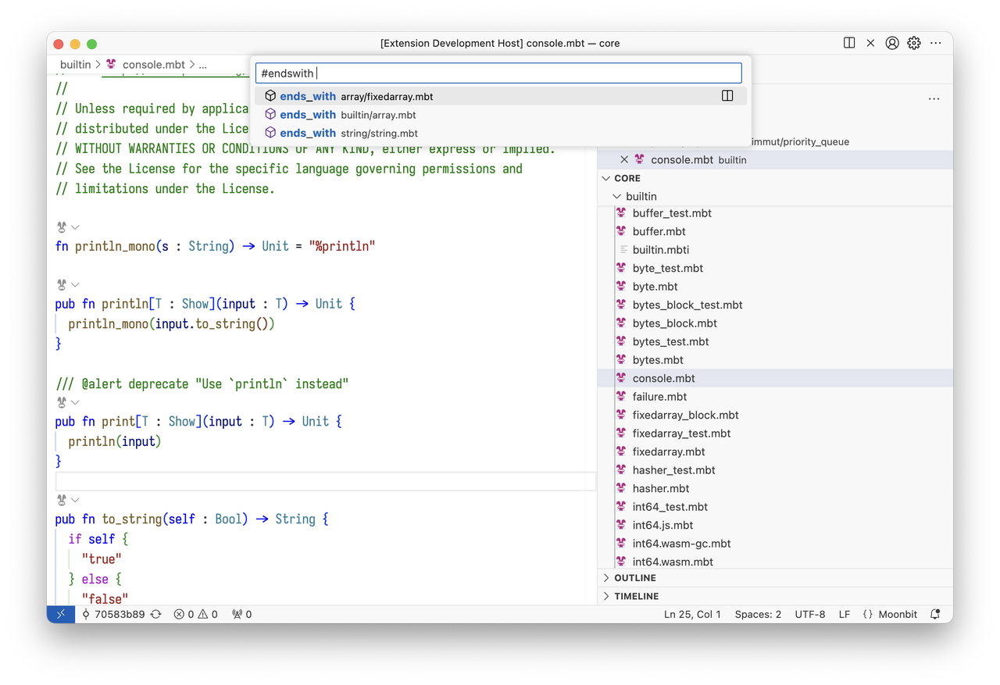

# weekly 2024-09-18

## Language Updates

- **Simplified Field Access for `type`**

The `type` system now supports passing field access to internal types.

```moonbit
struct UnderlyingType {
  field1: Int,
  field2: Bool
}

type Newtype UnderlyingType

fn main {
  let newtype = Newtype({ field1: 100, field2: true })
  println(newtype.field1) // 100
  println(newtype.field2) // true
}
```

Previously, to access the `field1` of `UnderlyingType` within `newtype`, you had to use `newtype._.field1`. Now, you can access `field1` directly via `newtype.field1`.

- **JSON serialization via `derive`**

Supports custom types implementing `ToJson` and `FromJson` traits via `derive`.

`derive(ToJson)` automatically generates the necessary implementation for a type, and the resulting JSON format is compatible with the auto-generated `FromJson`.

```moonbit
struct Record {
  field1: Int,
  field2: Enum
} derive(Show, ToJson, FromJson)

enum Enum {
  Constr1(Int, Bool?),
  Constr2
} derive(Show, ToJson, FromJson)

fn main {
  let record = { field1: 20, field2: Constr1(5, Some(true)) }
  println(record.to_json().stringify())
  // Output: {"field1":20,"field2":{"$tag":"Constr1","0":5,"1":true}}
  let json = record.to_json()
  try {
    let record: Record = @json.from_json!(json)
    println(record)
    // Output: {field1: 20, field2: Constr1(5, Some(true))}
  } catch {
    @json.JsonDecodeError(err) => println(err)
  }
}
```

- **Guard Statement Support**

Two forms, `guard` and `guard let`, to enforce invariants and reduce indentation from pattern matching.

```moonbit
fn init {
  guard invariant else { otherwise }
  continue_part
}
```

The `invariant` in `guard` is a `Bool` expression. If true, `continue_part` executes; otherwise, `otherwise` runs, and the rest of the `continue_part` is skipped. The `else { otherwise }` part is optional; if omitted, the program terminates when `invariant` is false.

```moonbit
fn init {
  guard let ok_pattern = expr1 else {
    fail_pattern1 => expr2
    fail_pattern2 => expr3
  }
  continue_part
}
```

`guard let` works similarly to `guard`, but it supports additional pattern matching. When `expr1` matches the `ok_pattern`, the `continue_part` is executed; otherwise, it tries to match the branches inside the `else` block.

If the `else` block is omitted or no branch matches, the program terminates. The `ok_pattern` can introduce new bindings, which are available throughout the entire `continue_part`. Here’s an example:

```moonbit
fn f(map: Map[String, Int]) -> Int!Error {
  guard let Some(x) = map["key1"] else {
    None => fail!("key1 not found")
  }
  x + 1
}
```

- **moonfmt Adjustments**

For `if`, `match`, `loop`, `while`, `for`, and `try` expressions used outside of a statement context, parentheses will automatically be added during formatting.

**Next week, we will adjust the precedence of `if`, `match`, `loop`, `while`, `for`, `try`, and infix expressions**, which is a breaking change. After this adjustment, these expressions can no longer appear directly in places where infix expressions are required by syntax. For example, the following code will be considered invalid in the future:

```moonbit
if if cond {a} else {b} {v} else {d}
match match expr { ... } { ... }
let a = expr1 + expr2 + if a {b} else {c} + expr3
guard if a {b} else {c} else { d }
```

After the adjustment, the original code will require additional parentheses:

```moonbit
if (if cond {a} else {b}) {v} else {d}
match (match expr { ... }) { ... }
let a = expr1 + expr2 + (if a {b} else {c}) + expr3
guard (if a {b} else {c}) else { d }
```

After the adjustment, the original code will require additional parentheses:

We recommend using `let x = y` to introduce new bindings for intermediate results of `if`, `match`, and similar expressions to improve code readability without introducing extra overhead. For example:

```moonbit
// not suggested
match (match expr { ... }) + (if a {b} else {c}) + expr { ... }
// suggested
let r1 = match expr { ... }
let r2 = if a {b} else {c}
match r1 + r2 + expr {
  ...
}
```

Functions like `.land()`, `lor()`, `shl()`, and `op_shr()` will now use the infix operators `&`, `|`, `<<`, and `>>` after formatting.

## IDE Updates

- Global project-wide symbol search supported.

- Fixed renaming bug that overwrote package names.
- Optimized automatic execution of `moon check` during plugin use.
- Added completion for keywords and `Bool` literals.
- Adapted conditional compilation to the build system, while maintaining compatibility with the original method of distinguishing backends through file name suffixes (e.g., `x.wasm.mbt`, `x.js.mbt`).

## Build System Updates

- **Added support for build graph visualization.**

By passing `--build-graph` after `moon check | build | test`, a `.dot` file of the build graph will be generated in the corresponding build directory after compilation.

- `moon.pkg.json` now includes a `targets` field for defining conditional compilation expressions at the file level.

These expressions support three logical operators: `and`, `or`, and `not`. The `or` operator can be omitted, so `["or", "wasm", "wasm-gc"]` can be simplified to `["wasm", "wasm-gc"]`. The conditions include backend types (`"wasm"`, `"wasm-gc"`, and `"js"`) and optimization levels (`"debug"` and `"release"`). Nested conditions are also supported. If a file is not listed in the `targets` field, it will be compiled under all conditions by default.

sample:

```json
    {
    "targets": {
        "only_js.mbt": ["js"],
        "not_js.mbt": ["not", "js"],
        "only_debug.mbt": ["and", "debug"],
        "js_and_release.mbt": ["and", "js", "release"],
        "js_only_test.mbt": ["js"],
        "complex.mbt": ["or", ["and", "wasm", "release"], ["and", "js", "debug"]]
    }
}
```

- The `moon.pkg.json` file now includes a `pre-build` field for configuring pre-build commands. These commands will be executed before running `moon check | build | test`. The `pre-build` field is an array, where each element is an object containing three fields: `input`, `output`, and `command`.

a. `input` and `output` can be either strings or arrays of strings.

b. `command` is a string where you can use any command-line command, along with `$input` and `$output` variables representing input and output files (if they are arrays, they are joined with spaces).

A special built-in command `:embed` is available to convert files into MoonBit source code:

a. `-text` (default) embeds text files, while `-binary` embeds binary files.

b. `-name` specifies the generated variable name, with a default value of `resource`.

The commands are executed in the directory where the `moon.pkg.json` file resides.

Sample: `moon.pkg.json`

```json
{
  "pre-build": [
    {
      "input": "a.txt",
     "output": "a.mbt",
      "command": ":embed -i $input -o $output"
    }
  ]
}
```

if `a.txt` is:

```json
hello,
world
```

After executing `moon build`, the following `a.mbt` file is generated in the directory where `moon.pkg.json` is located:

```json
let resource : String =
  #|hello,
  #|world
  #|
```

- `moon test --target all` now supports backend suffixes (`[wasm]`, `[js]`, etc.).

```json
$ moon test --target all
Total tests: 0, passed: 0, failed: 0. [wasm]
Total tests: 0, passed: 0, failed: 0. [js]
```
