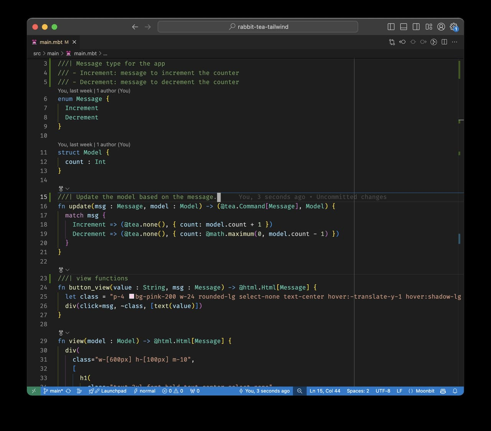
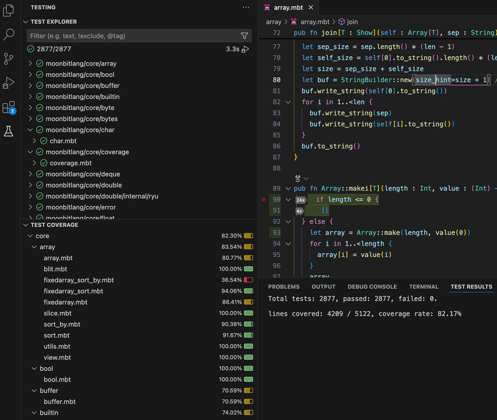
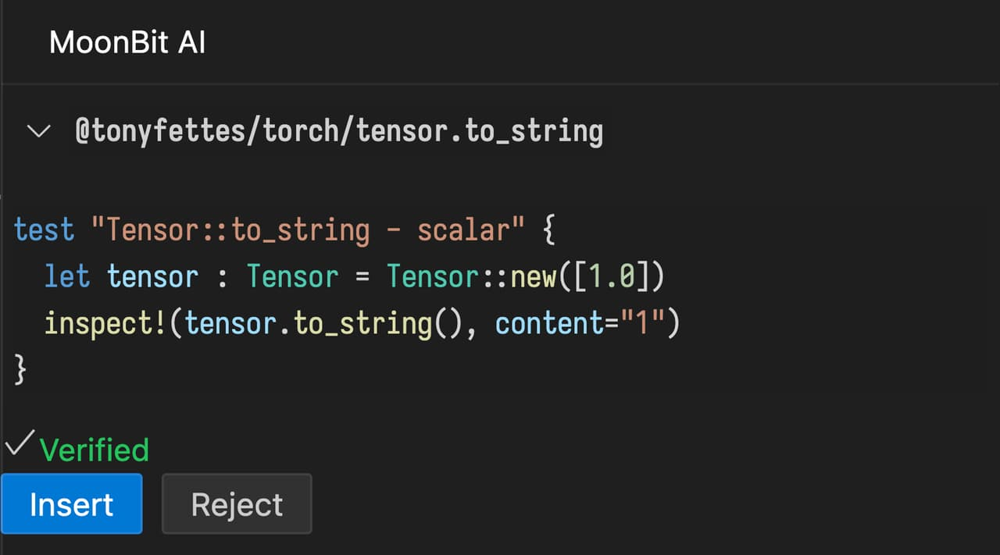

# 2024-11-04

## Language Updates

- Compile-time Constants Support
  - Introduced support for constants declared with `const C = ...`, where names start with uppercase letters. Must be built-in numeric types or `String`. Constants can be used as regular values and for pattern matching. Currently, the values of constants can only be literals.

```moonbit
const MIN_INT = 0x1000_0000
const MAX_INT = 0x7fff_ffff

fn classify_int(x : Int) -> Unit {
  match x {
    MIN_INT => println("smallest int")
    MAX_INT => println("largest int")
    _ => println("other int")
  }
}

fn main {
  classify_int(MIN_INT) // smallest int
  classify_int(MAX_INT) // largest int
  classify_int(42) // other int
}
```

- Improved Unused Warnings

1. Added detection for unused parameters in `enum`:

```moonbit
enum E {
  // Compiler warns if y is unused
  C(~x : Int, ~y : Int)
}

fn f(x : E) -> Unit {
  match x {
    C(~x, ..) => println(x)
  }
}

fn main {
  f(C(x=1, y=2))
}
```

2. Added detection for unused default parameter values (default off):

```moonbit
// The function `f` is private and that the caller always provides a value for `x` explicitly when calling it.
// If warning 32 is enabled (which is off by default), the compiler will notify the developer that the default value for `x` is unused.
fn f(~x : Int = 0) -> Unit {
  println(x)
}

fn main {
  f(x=1)
}
```

- Direct Function Imports
  - Functions from other packages can now be directly imported without the `@pkg.` prefix. To set this up, you must declare the functions in the `"value"` field of the `moon.pkg.json` configuration file.

```json
{
  "import": [
    {
      "path": "moonbitlang/pkg",
      "alias": "pkg",
      "value": ["foo", "bar"]
    }
  ]
}
```

In this example, the functions `foo` and `bar` from the package `moonbitlang/pkg` can be called directly without the prefix `@pkg.`.

- Native JavaScript `BigInt` Support
  - `BigInt` type compiles to native JavaScript `BigInt`, with efficient pattern matching using switch statements.

- Experimental: JavaScript backend generates `.d.ts` for exported functions
  - JavaScript backend now generates `.d.ts` files based on [exported functions](https://docs.moonbitlang.com/ffi-and-wasm-host/#exported-functions) specified in `moon.pkg.json`, enhancing TypeScript/JavaScript integration. (*This feature for exporting complex types is still under design, and for now, it generates TypeScript's `any` type.)

## IDE Updates

- Block-line Support
  - Introduced special `block-line` markers (`///|`) in top-level comments (`///`) to enhance code readability and structure:

  - Use `moon fmt --block-style` can automatically add these markers. In the future, incremental code parsing and type checking based on block-line markers will further enhance the responsiveness and usability of the Language Server Protocol (LSP), improving development efficiency.

- MoonBit [Online IDE](https://try.moonbitlang.com) can visit GitHub repos for instant review, edit, and test.

1. Go to a MoonBit-based repo on GitHub.
2. Replace github.com with `try.moonbitlang.com`.

- Test Coverage Visualization
  - Added support for visualizing test coverage in the test explorer:


- AI Features
  - Added `/doc-pub` command for generating documentation for public functions.
  - Fixed issue where `/doc` command would overwrite pragmas.
  - Patch now verifies generated test cases:


## Build System Updates

- Package Checking
  - `moon check` supports checking specified packages and their dependencies: `moon check /path/to/pkg`.

## MoonBit Markdown Library

- Open Source
  - The MoonBit Markdown library is now [open source](https://github.com/moonbit-community/cmark), and available for download on MoonBit's package manager [mooncakes.io](https://mooncakes.io/).
