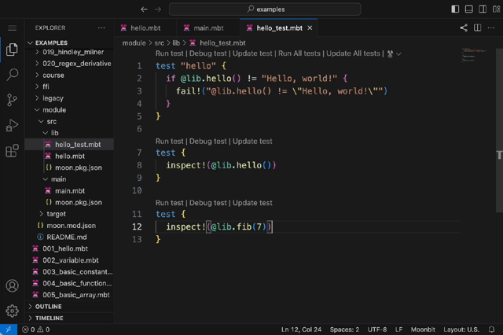
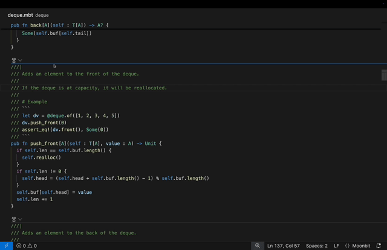
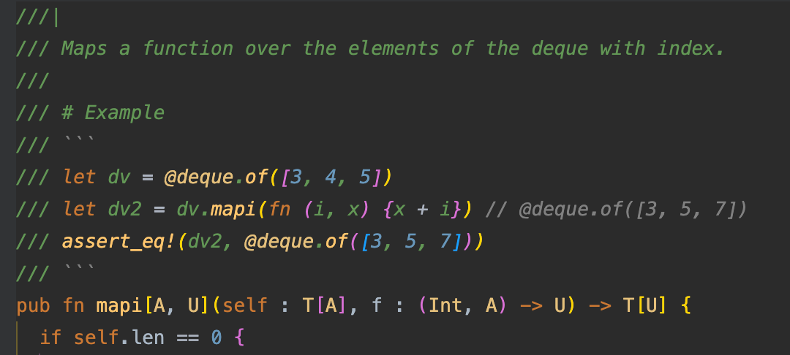

# 2024-12-02

## Language Updates

- **Added support for range patterns** to match a range of integer or character values in pattern matching.

The syntax for range patterns is `a..<b` (excluding the upper bound `b`) or `a..=b` (including the upper bound `b`). Bounds can be literals, constants declared with `const`, or `_`, which indicates no constraint on that side:

```moonbit
const Zero = 0
fn sign(x : Int) -> Int {
  match x {
    _..<Zero => -1
    Zero => 0
    Zero..<_ => 1
  }
}

fn classify_char(c : Char) -> String {
  match c {
    'a'..='z' => "lowercase"
    'A'..='Z' => "uppercase"
    '0'..='9' => "digit"
    _ => "other"
  }
}
```

- **Support calling `trait` with `x.f(...)`**

```moonbit
trait I {
  f(Self) -> Unit
}

type MyType Int
impl I for MyType with f(self) { println(self._) }

fn main {
  let my : MyType = 42
  my.f()// Output 42
}
```

If `x` has type `T`, the `x.f(...)` syntax resolves as follows:

1. If `T` defines a method `f`, call `T::f`.
2. If a `trait` does `impl SomeTrait for T with f` in **the same package as `T`**, call `SomeTrait::f`. If multiple `f` are found, the compiler reports an ambiguity error.
3. If neither of the above applies, the compiler searches for `impl SomeTrait for T with f` within the current package. Notice that this rule only work in current package. If `T` is defined outside the current package, local implementation for `T` cannot be called with dot syntax outside.

These rules enhance the flexibility of MoonBit’s dot syntax while maintaining semantic clarity and strong refactor safety. Resolution of `x.f(...)` only involves the package defining `T` and the current package, avoiding issues caused by newly introduced dependencies.

- **Added support for trait alias**

No new syntax is introduced. Trait aliases use the same syntax as type aliases:

```swift
typealias MyShow = Show
impl MyShow for MyType with ...
```

## IDE Updates

- **[Web IDE](https://try.moonbitlang.com) now supports updating inspect tests.**


- **Generated code can be revised in MoonBit AI before inserting**, and the revised code is automatically checked for syntax and type correctness.


- Fixed syntax highlighting issues for Markdown code blocks in documentation comments.

## Build System Updates

- `moon check` now supports passing a warn list.

- `moon test` can run tests embedded in project documentation.
  - Usage: `moon test --doc` runs all tests within documentation comments of the current project.
  - Note: Tests must be enclosed between lines with ```. For example:


- Fixed an issue with local functions and return expressions in `moon fmt`.

- Fixed an issue in `moon fmt` which comments near array indexing syntax are misplaced during formatting.

- `moon fmt` enabled `-block-style` by default.

## Docs Update

- MoonBit Docs is now available on [readthedocs.io](https://moonbit-docs.readthedocs.io/en/latest/).
