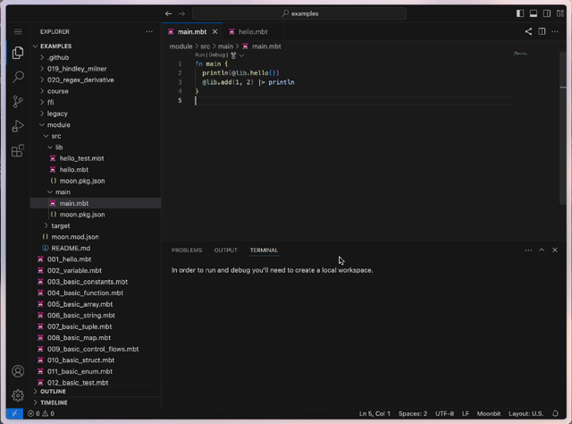
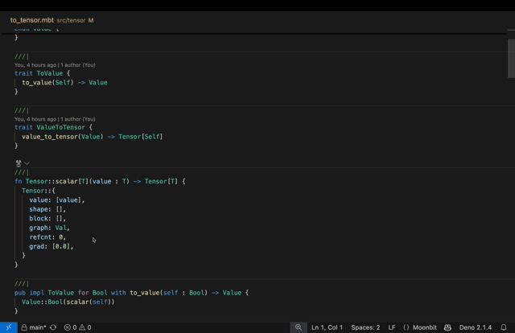

# 2024-12-16

## Language Update

- **New Trait object syntax: `&Trait`**

Trait object syntax has been changed from writing `Trait` directly to `&Trait` (the old syntax has been deprecated). We made this change to separate trait object type and the trait itself syntactically and avoid confusion. All places that mention trait objects, including type annotation, defiing method on trait objects (`fn &Trait::method(...)`) and trait object creation (`... as &Trait`) should be modified to adapt to this change.

- **New Local Types Language Feature**

It’s now possible to declare types (structs, enums, newtypes) that are only visible within the scope of the current top-level function. You can also use `derive` to add new methods to these local types. For example:

```SQL
fn toplevel[T: Show](x: T) -> Unit {
  enum LocalEnum {
    A(T)
    B(Int)
  } derive(Show)
  struct LocalStruct {
    a: (String, T)
  } derive(Show)
  type LocalNewtype T derive(Show)
  ...
}
```

Note that local types can use the generic parameters of the current top-level function but cannot introduce additional generics of their own. Local types can use `derive` to generate associated methods, but they cannot define other new methods. Also, declaring an `error` type within a local type is not yet supported.

## IDE Update

- Fixed some LSP related bugs.
  - Fixed the bug that when hovering, the type of the payload and the type of the error type are linked together.
  - Fixed a bug where LSP would not serve a single file after adding it to a module (creating moon.pkg.json in the same level folder) and then removing it (deleting moon.pkg.json).
  - Fixed test-import-all configurations that were broken sometimes.
  - Fix a bug in LSP's strange inlay hint.

- Enable block-line option for LSP formatter.

- LSP supports warn-list configuration.

- Optimise the debug experience in web IDE. When user opens devtools and clicks debug, it will directly stop at the main function.



- Allow test {} wrapping in doctest, support for updating inspect and panic test.

```moonbit
/// ```
/// test "panic test xxx" {
/// panic()
/// }
/// ```
```

- **MoonBit AI Feature**

The AI now supports model switching, interruption, and retrying while generating.



## Build System Update

- `moon run` runs a test with the support of passing --stack-size directly to adjust the v8 stack size.

- **Breaking Change**

During black-box testing, the `public` definitions from the tested package will be automatically imported. For example, when testing the `@json` package, functions or types from `@json` can be used without prefixing `@json`. To disable this behavior, you must specify `"test-import-all": false` in the `moon.pkg.json` file.

## Document Update

- **MoonBit Tour**

The tutorials on [Web IDE](https://try.moonbitlang.cn) have been migrated to the new [tour](https://tour.moonbitlang.com), with changes and additions made accordingly. The code repo is [here](https://github.com/moonbitlang/moonbit-docs/tree/main/moonbit-tour).
