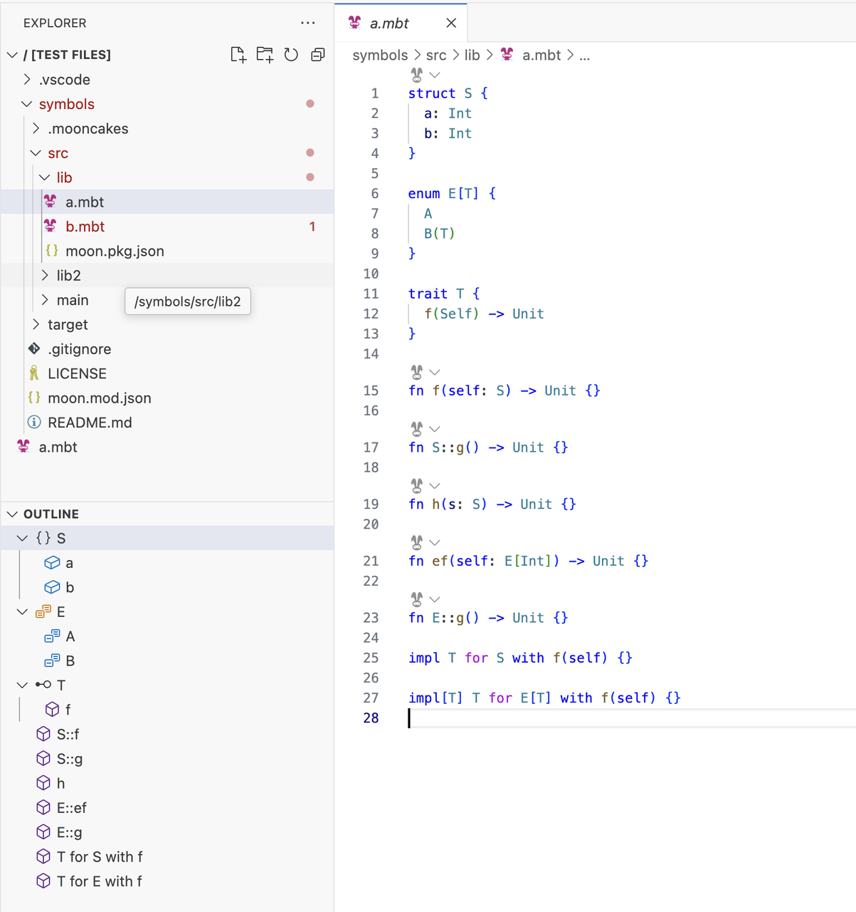
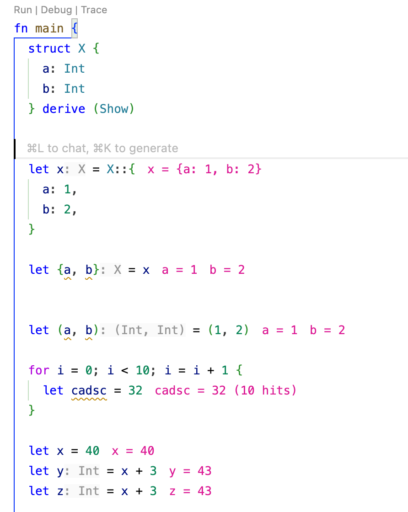

# 2024-12-30

## Language Update

- Added labeled loop syntax, which allows you to jump directly to a specified layer in a multi-layer loop, using `~` as the suffix for the label.

```moonbit
fn f[A](xs : ArrayView[A], ys : Iter[Int]) -> @immut/list.T[(Int, A)] {
  l1~: loop 0, xs, @immut/list.Nil {
    _, [], acc => acc
    i, [x, .. as rest], acc =>
      for j in ys {
        if j == i {
          continue l1~ i + 1, rest, @immut/list.Cons((j, x), acc)
        }
        if j + i == 7 {
          break l1~ acc
        }
      } else {
        continue i - 1, rest, acc
      }
  }
}
```

- New Discard Argument, function arguments named with a single underscore will be discarded, multiple arguments can be discarded within the same function.

```moonbit
fn positional(a : Int, b : Int) -> Int {
  a + b
}

fn discard_positional(_: Int, _: Int) -> Int {
  1
}
```

- The semantics of `pub` have officially changed from being fully public to read-only, and the `pub(readonly)` syntax has been deprecated. To declare a fully public `type`/`struct`/`enum`, you should now use `pub(all)`. To declare a fully public (externally implementable) `trait`, use `pub(open)`. This change was previously announced via a warning, and if you already followed the warning and updated `pub` to `pub(all)` or `pub(open)`, you only need to replace `pub(readonly)` with `pub` to complete the migration. The `moon fmt` tool can automatically convert `pub(readonly)` to `pub`.

- In the future, the behavior where a `trait` will fallback to method implementation if no explicit implementation is found **may** be removed. We encourage new code to use the explicit `impl Trait for Type` syntax instead of relying on methods for trait implementation. In cases of no ambiguity, you can still use dot syntax (`impl Trait for Type with method(...)`), so adopting explicit `impl` syntax won't sacrifice convenience.

- The old prefix syntax for labeled parameters has been removed.

- The old syntax for accessing newtype contents using `.0` has been removed. Additionally, if a newtype contains a tuple, index access like `.0`, `.1`, etc., will now automatically forward to the tuple inside the newtype. For example:

```moonbit
type Tuple (Int, String)

fn main {
  let t = (4, "2")
  println(t.0) // 4
  println(t.1) // 2
}
```

- Parameters have been added to `derive(FromJson)` and `derive(ToJson)` to control the specific behavior and data layout of type serialization and deserialization. The detailed changes can be found in [Docs > Language > Deriving](https://docs.moonbitlang.com/en/latest/language/derive.html#deriving-traits).

  You can now rename fields and adjust the serialization format of enums. The specific behavior of JSON serialization and deserialization may be optimized and changed in the future.

```moonbit
enum UntaggedEnum {
  C1(Int)
  C2(String)
} derive(ToJson(repr(untagged)), Show)
// { "0": 123 }, { "0": "str" }

enum InternallyTaggedEnum {
  C1(Int)
  C2(String)
} derive(ToJson(repr(tag="t")), Show)
// { "t": "C1", "0": 123 }

enum ExternallyTaggedEnum {
  C1(Int)
  C2(String)
} derive(ToJson(repr(ext_tagged)), Show)
// { "C1": { "0": 123 } }

enum AdjacentlyTaggedEnum {
  C1(Int)
  C2(String)
} derive(ToJson(repr(tag="t", contents="c")), Show)
// { "t": "C1", "c": { "0": 123 } }

struct FieldRenameAllCamel {
  my_field : Int
} derive(ToJson(rename_all="camelCase", repr(tag="t")), Show)
// { "t": "fieldRenameAllCamel", "myField": 42 }

struct FieldRenameAllScreamingSnake {
  my_field : Int
} derive(ToJson(rename_all="SCREAMING_SNAKE_CASE", repr(tag="t")), Show)
// { "t": "FIELD_RENAME_ALL_SCREAMING_SNAKE", "MY_FIELD": 42 }
```

## IDE Update

- IDE now supports gotodef/gotoref/rename for loop label.

- Document symbols are now displayed in a hierarchical way in the IDE, as follows.


- Fixed bug in white box testing regarding type renaming.

- Added IDE support for automatically omitting parameter inlay hints in case of repetition.

- IDE adds value tracing. Clicking on "Trace" codelen above the `main` function will enable it, and clicking again will disable it.

  - For variables inside a loop, only the latest value and the hit count are shown.
  

## Build System Update

- moon adds a `--no-strip` parameter to preserve symbol information in release build mode.

## Document Update

- Fixed an issue where MoonBit Tour's theme was not maintained when switching pages.

- Added range, range pattern and newtype sections to [MoonBit Tour](https://tour.moonbitlang.com/).
