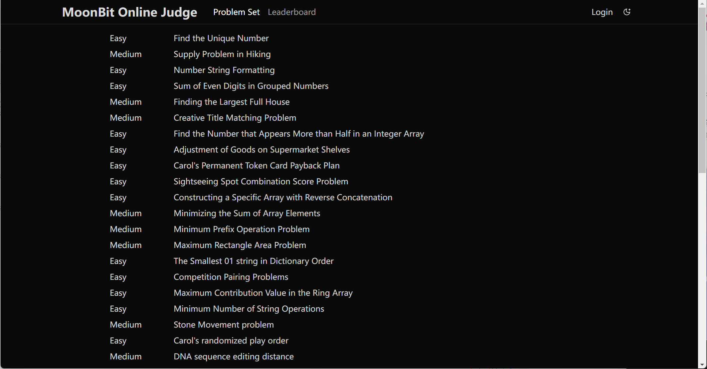

import Command from "./command.webm"
import Workspace from "./workspace.webm"

# 2025-01-13

## Language Updates

- **Experimental Async Support**

  Experimental support for asynchronous programming has been added. You can declare asynchronous functions using `async fn ...` and call them with `f!!(...)`. MoonBit also provides primitives for interrupting control flow. For details, see [docs/async-experimental](https://docs.moonbitlang.com/en/latest/language/async-experimental.html).

  Currently, the async standard library and event loop are under development. Using the JavaScript backend's event loop and Promise API is easier for asynchronous programming. **As this feature is experimental, breaking changes may occur based on feedback. We welcome and appreciate your testing and feedback**.

- **Upcoming Changes to Method Semantics**

  Later this week, we will make major changes to simplify method-related rules. Currently:

  - Methods can be declared as `fn f(self: T, ..)` or `fn T::f(..)`.

  - Methods with `Self` as the first parameter can be called with `xx.f(..)`.

  - If unambiguous, methods can also be called with `f(..)`.

  However, the last rule lacks user control and consistency between call syntax (`f(..)`) and declaration syntax (`T::f(..)`). The new design will:

  - Allow `fn f(self: T, ..)` to define methods callable with `xx.f(..)` or `f(..)`. These methods share the same namespace as regular functions and cannot have duplicate names.

  - Allow `fn T::f(..)` to define methods callable with `xx.f(..)` or `T::f(..)`. These methods cannot be called as regular functions (`f(..)`).

  Intuition: All `fn f(..)` definitions are regular functions, while `fn T::f(..)` definitions are placed in a small namespace associated with `T`.

  For methods like `new` (without `Self` as the first parameter), use `fn new(..)` to enable direct calls as `new(..)`. Library authors are encouraged to:

  - Use `fn f(..)` for unambiguous functions and make the first parameter `self` for `xx.f(..)` calls.

  - Use `fn T::f(..)` for potentially ambiguous functions to place them in a scoped namespace.

- **Enhanced Alerts**

  - Trigger alerts on type usage.

  - Trigger alerts on specific constructor usage.

- **Improvements to `ArrayView`/`BytesView`/`StringView`**:
1. Support for negative indices in view operations, e.g.:
```moonbit
let arr = [1, 2, 3, 4, 5]
let arr_view = arr[-4:-1]
println(arr_view) // [2, 3, 4]
```
2. Support for pattern matching in `BytesView` with byte literals, e.g.:
```moonbit
fn f(bs: BytesView) -> Option[(Byte, BytesView)] {
  match bs {
    [b'a'..=b'z' as b, ..bs] => Some((b, bs)),
    _ => None
  }
}
let s = b"hello"[:]
let r = f(s)
println(r) // Some((b'\x68', b"\x65\x6c\x6c\x6f"))
```

3. The `as` keyword in array patterns is now optional. `[a, ..rest, b]` is valid, and the formatter will automatically omit `as` from `[a, ..as rest, b]`.

## IDE Updates

- Added a command to toggle multi-line strings.

<video autoPlay loop muted playsInline src={Command} style={{width: '100%'}}></video>

- Added more detailed information to workspace symbols, making it easier to search for specific functions and types.

<video autoPlay loop muted playsInline src={Workspace} style={{width: '100%'}}></video>

## Build System Updates

- Fixed a bug in doc tests affecting multi-line string test results.

## Documentation Updates

- [MoonBit Tour](https://tour.moonbitlang.com) now supports debug codelens with value tracking enabled by default.

- Launch [Moonbit Online Judge](https://oj.moonbitlang.com), a platform for users to learn MoonBit by solving problems.



## Standard Library Updates

- Updated the behavior of `Int64` to `JSON` conversions. Precision is no longer lost through `Double` conversion; values are now preserved as strings.