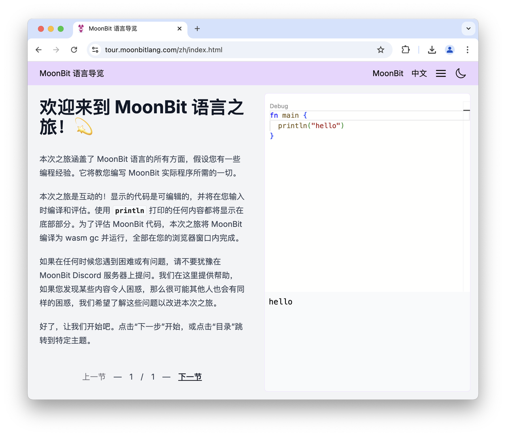

import Enabled from "./enabled.webm"

# 2025-02-24

## Language Update

### Enhancements to String Pattern Matching

a. Support for String Literals in Array Patterns

You can now use the `..` operator to match a substring within an array pattern of type `String`:

```moonbit
let str = "https://try.moonbitlang.com"
match str {
  [.."https://", ..path] => println(path)
  [.."http://", ..path] => println(path)
  _ => println("unexpected protocol")
}
```

This is a simplified version of the following code:

```moonbit
 let str = "https://try.moonbitlang.com"
 match str {
   ['h', 't', 't', 'p', 's', ':', '/', '/', .. path] => println(path)
   ['h', 't', 't', 'p', ':', '/', '/', .. path] => println(path)
   _ => println("unexpected protocol")
 }
```

b. Support for Using `const` Constants in Array Patterns

```moonbit
const HTTP = "http://"
const HTTPS = "https://"

///|
fn main {
  let str = "https://try.moonbitlang.com"
  match str {
    [..HTTP, .. path] => println(path)
    [..HTTPS, .. path] => println(path)
    _ => println("unexpected protocol")
  }
}
```

### Support for `is` Expression in `while` Conditions

```moonbit
fn main {
  let queue = @queue.of([1,2,3])
  while queue.pop() is Some(n) {
    println(n)
  }
}
// Output:
// 1
// 2
// 3
```

### Support for `String` Type in Array Literals

Array literals now support the `String` type.

### Breaking Change in C FFI Handling

[BREAKING CHANGE] In C FFI, all MoonBit objects now point to the first field instead of the object header. In the native MoonBit backend, each object has an object header (defined in `moonbit.h`) to support garbage collection. Previously, MoonBit objects in the native backend were pointers to the object header, meaning C wrapper functions were required to skip over the header to access actual data when binding MoonBit to C FFI. To improve the C FFI experience, we now have MoonBit objects pointing directly to the first field of the object instead. This eliminates the need to explicitly handle object headers in C FFI bindings. For example, `Bytes` can now directly represent `const char*` or `void*`, and `FixedArray[T]` can represent `T*` without needing C wrappers.

  However, this change is a breaking change for C FFI. Existing C wrappers that skip object headers will need to be updated. Libraries or programs using C FFI should be modified after this compiler update.

### New `FuncRef[T]` Type for FFI

A new special type `FuncRef[T]` has been added in `moonbitlang/builtin`, representing a non-capturing function of type `T`. This type is used for FFI callbacks, such as Unix signal handlers. You create a `FuncRef[T]` by writing an uncaptured anonymous function where a `FuncRef` is expected. `FuncRef[T]` cannot be called directly, as it is intended for FFI binding.

### External Type Syntax Update

 The syntax for external types used in FFI has changed to `extern type T`. Previously, external types were defined using `type T`. Going forward, we will use the more explicit `extern type T` syntax for external types. The old `type T` syntax is deprecated, and the compiler will issue a warning. You can automatically complete this syntax migration using `moon fmt`.

  Once the old `type T` syntax is completely removed, we will use it for other purposes. `extern type T` refers to an entirely external object, and the MoonBit garbage collector will not manage it. In the future, `type T` will represent externally sourced objects with standard MoonBit object structures, subject to garbage collection, such as FFI objects with custom finalizers.

### Removal of Old Trait Object Syntax

The old trait object syntax has been removed. The compiler had previously issued a warning for the old trait object syntax, and now the old `Trait` syntax has been removed. Trait object types should now be written as `&Trait`.

## Build System Updates

- `moon info` now supports the `--package` argument to specify which package to process.

- The `moon.pkg.json` configuration file now includes a `supported-targets` field to specify the backends supported by the current package (defaults to all backends if not set). If you try to build the package in an unsupported backend or the backend of a dependency is incompatible, the build system will raise an error.

- The `moon.pkg.json` file now includes a `native-stub` field to declare `.c` files that need to be built and linked alongside the package.

## IDE Updates

- A new IDE installer has been added. For Windows desktop, we have packaged an IDE installer with the integrated MoonBit plugin. You can download and install the development environment via [https://cli.moonbitlang.cn/vscode/latest/win32-x64-user.exe](https://cli.moonbitlang.cn/vscode/latest/win32-x64-user.exe).

- The MoonBit Interactive Tutorial site: [https://tour.moonbitlang.com](https://tour.moonbitlang.com) now has a Chinese version.



- Language services now support processing MoonBit code within markdown. To enable this, add the following configuration at the beginning of the markdown:

```YAML
---
moonbit: true
---
```

<video autoPlay loop muted playsInline src={Enabled} style={{width: '100%'}}></video>
