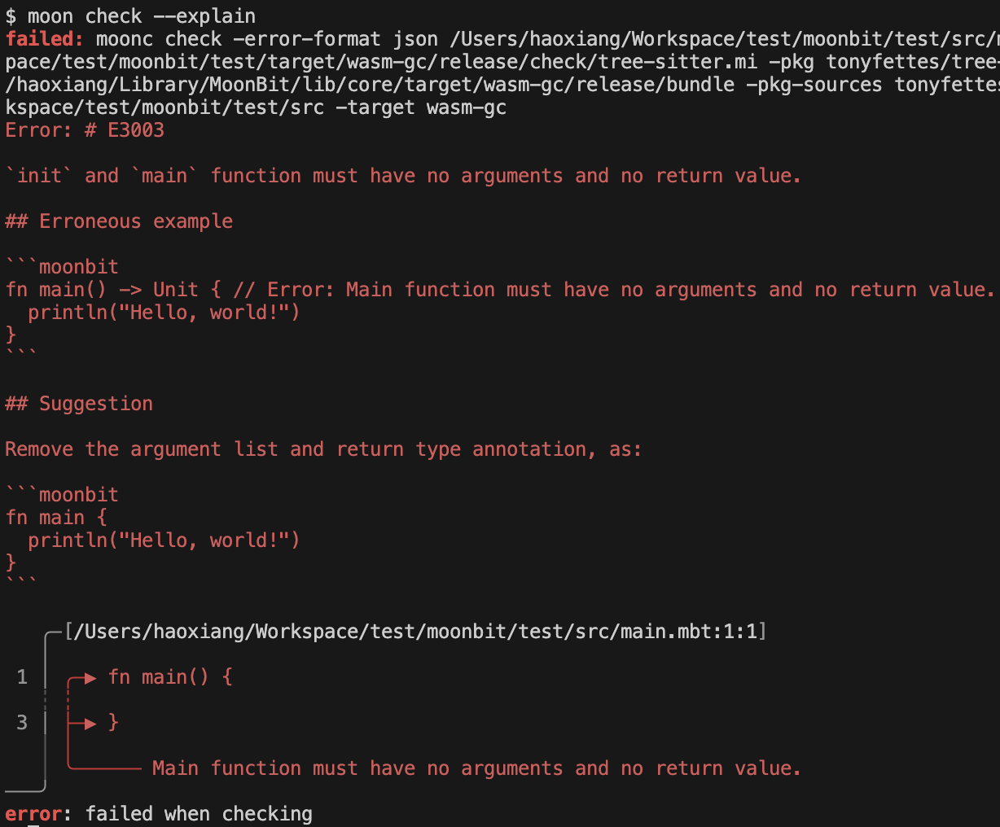
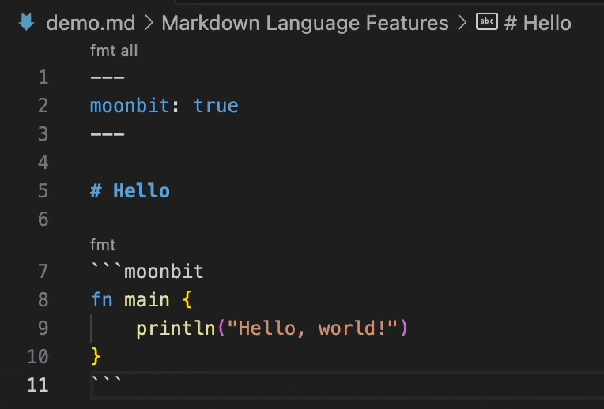

# 2025-03-10

## Language Updates

### Pattern Guards

Pattern guards can be specified by appending `if ...` to a pattern. A branch with a pattern guard will only execute if the matched value satisfies the pattern and the guard condition evaluates to true. If the guard evaluates to false, the match will continue to the next applicable branch.

This feature simplifies code using pattern matching. For example, simplifying arithmetic expressions:

```moonbit
fn simplify(e : Expr) -> Expr {
  match e {
    Add(e1, Lit(0)) => e1
    Sub(e1, e2) if e1 == e2 => Lit(0)
    //          ^^^^^^^^^^^ pattern guard
    _ => e
  }
}
```

Pattern guards can also be used with the `is` expression to introduce new variables. For example:

```moonbit
fn json_get_key(json : Json, key : String) -> Json! {
  match json {
    Object(map) if map[key] is Some(value) => value
    _ => fail!("key not found: \{key}")
  }
}
```

### Attribute Syntax

Attribute syntax is now supported as a replacement for the old `@alert deprecated "message"` pragmas. Each attribute must be on a separate line, and line breaks are not allowed within attributes.

Supported attributes:

1. `#deprecated("message")` – Marks a function as deprecated and displays a message when used.
2. `#coverage.skip` – Excludes a function from coverage testing.

The old pragma syntax will be removed in the future.

```moonbit
#deprecated("use function g instead")
#coverage.skip
fn f() -> Unit {
  ...
}
```

### `Bytes` Type Supports String Literals for Initialization and Assignment

The `Bytes` type now supports initialization and assignment using string literals. The string is stored as UTF-8 encoded `Bytes`. For example:

```moonbit
fn main {
  let xs : Bytes = "123"
  let ys : Bytes = "你好，世界"
}
```

### `enum` Supports Custom Tag Values

Enums now support custom tag values, which is useful when interfacing with native C FFI. For example, using the `open` syscall:

```moonbit
enum OpenFlag {
  O_RDONLY = 0x00
  O_WRONLY = 0x01
  O_RDWR   = 0x02
}

extern "c" fn open(path : Bytes, flag : OpenFlag) -> Int = "open"

test {
  let path : Bytes = "tmp.txt"
  let fd = open(path, O_RDONLY)
}
```

### Enhanced `const` Declarations

`const` now supports:

- Referencing other constants.
- Arithmetic, bitwise, and comparison operations on built-in types.

Example:

```moonbit
const A : Int = 1 + 2 * 3
const B : Int = A * 6
```

### Deprecating Implicit Trait Implementation via Methods

Implicit trait implementation via methods is now deprecated. To implement a trait for a type, an explicit `impl` block must be used.

```moonbit
// Implicitly implementing Show for T (deprecated)
fn T::output(self : T, logger : &Logger) -> Unit {
  ...
}

// You should migrate to explicit implementation
impl Show for T with output(Self : T, logger : &Logger) -> Unit {
  ...
}
```

### Removed Direct Invocation of `fn T::f(..)`

Direct invocation of `fn T::f(..)` has been removed, following prior deprecation warnings. In the future:

- Methods defined as `fn f(self : T, ..)` can be used as normal functions.
- Methods written as `fn T::f(..)` must be called using `T::f(..)` or `x.f(..)` syntax.

For more details on the new semantics, see [GitHub PR #1472](https://github.com/moonbitlang/core/pull/1472).

### Splitting Part of the Native Backend Runtime

A portion of the Native backend runtime has been moved into a separate C file located at `$MOON_HOME/lib/runtime.c`. If you use a custom build process, such as compiling the C file manually, ensure this file is included during compilation.

### LLVM Backend Released for Bleeding-Edge Toolchain

The LLVM backend is now available in the bleeding-edge toolchain. Currently, it supports x86_64 Linux and ARM64 macOS. To install the bleeding-edge version of MoonBit, run:

```bash
curl -fsSL https://cli.moonbitlang.com/install/unix.sh | bash -s 'bleeding'
```

You can then enable the LLVM backend during build, test, and run phases by passing the `--target llvm` option. Example:

```bash
moon build --target llvm
```

## Build System Updates

1. Added `moon check --explain`, which provides detailed information about error codes.
   

2. Added a `"native-stub"` configuration in `moon.pkg.json` to specify C stub files used in a package. These stubs are built and linked automatically during compilation. If your project previously included C stub files in `cc-flags`, you can now declare these C stub files in the `"native-stub"` field.

3. Relaxed the `moon publish` requirement to pass `moon check`. If `check` fails, users will be prompted whether they want to proceed with publishing.

## IDE Updates

1. Embedded MoonBit code blocks in Markdown now support formatting. Users can format MoonBit code inside Markdown using the MoonBit plugin.

   
