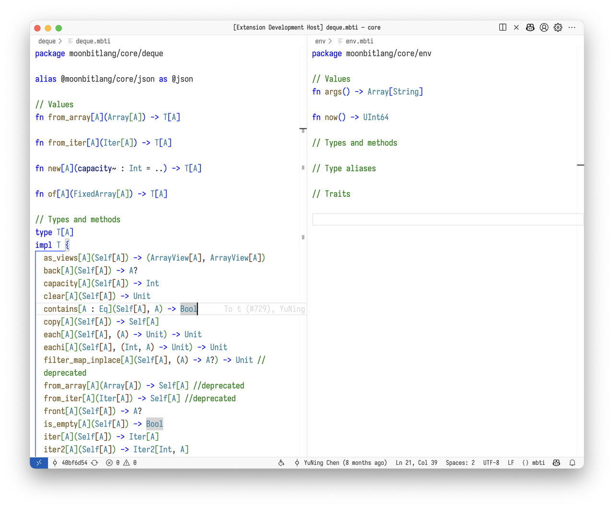
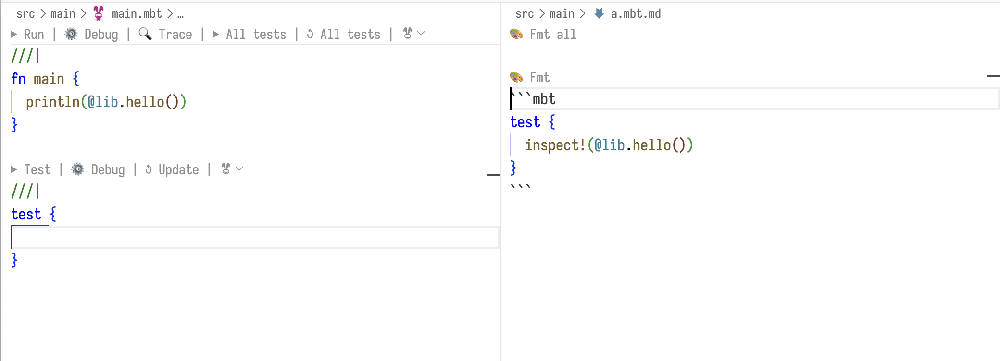

# 2025-03-24

## Language Updates

### Pattern Matching for `Bytes`

`Bytes` can now use array patterns for pattern matching.

```moonbit
fn main {
  let bytes : Bytes = "Hello, world!";
  match bytes {
    [..b"Hello", ..] => {
      println("Starts with \"Hello\"");
    }
    _ => {
      println("Doesn't start with \"Hello\"");
    }
  }
}
```

### `Char` Literals as `Int` & `Byte`

Character (`Char`) literals can now be used in places where an `Int` value is expected, with the semantic meaning being their corresponding Unicode code point. Additionally, character literals can also be used in places where a `Byte` value is expected, but if the Unicode code point exceeds the `Byte` range, an error will be raised.

```moonbit
fn main {
  let a : Int = 'a';
  println(a) // 97
  let b : Byte = 'a';
  println(b) // b'\x61'
  let c : Byte = '🎉';
  //             ^^^ Error: Char literal '🎉' for Byte is out of range.
}
```

### Adjustments to Escape Sequences in `String` and `Bytes` Literals

Due to ambiguities in interpreting escape sequences like `\x..` and `\o..` in different contexts (e.g., `String` type vs. `Bytes` type), we have made the following adjustments:

- In string literals used in `String`-typed positions, the escape sequences `\xFF` and `\o377` are now deprecated. It is recommended to use `\u00FF` or `\u{FF}` instead for better clarity. This change does not affect `Bytes` literals or string literals overloaded to `Bytes`, as shown in the following example:

```moonbit
let bytes1: Bytes = "\xFF\o377";  // ok
let bytes2 = b"\xFF\o377";        // ok, bytes2 == bytes1
let str: String = "\xFF\o377";    // warning: deprecated escape sequences
```

- Support for UTF-16 surrogate pairs (e.g., `\uD835\uDD04`) has been removed. For characters beyond the BMP (Basic Multilingual Plane) code points, use `\u{...}` instead.

- Unicode escape sequences are now deprecated in `Bytes` literals (`b"..."`) and string literals overloaded to `Bytes` (`"..."`).

```moonbit
let bytes1 = b"\u4E2D";          // deprecated, use b"\xE4\xB8\xAD" instead
let bytes2 = ("\u4E2D" : Bytes); // use ("\xE4\xB8\xAD" : Bytes) instead
```

### Operator Overloading with Traits

Operator overloading is no longer implemented by adding methods like `op_add`/`op_mul`/... to types. Instead, it is now implemented by implementing standard library (`core`) traits such as `Add`/`Mul`, etc. Below is a mapping of operators to their corresponding traits:

| Operator | Trait |
|----------|-------|
| `==` | `Eq` |
| `+` | `Add` |
| `-` | `Sub` |
| `*` | `Mul` |
| `/` | `Div` |
| `-` (prefix) | `Neg` |
| `%` | `Mod` |
| `&` | `BitAnd` |
| `\|` | `BitOr` |
| `^` | `BitXOr` |
| `<<` | `Shl` |
| `>>` | `Shr` |

If your code has custom operator overloading, you should replace method definitions with corresponding `trait` `impl` implementations. In the future, using methods for operator overloading will trigger warnings. Once the method-based overloading is fully removed, using methods to overload operators will result in compilation errors.

If your code defines `traits` containing operators, you should change those `trait` definitions to declare super traits corresponding to the operator. For example:

```moonbit
trait Number {
  op_add(Self, Self) -> Self
  op_mul(Self, Self) -> Self
  literal(Int) -> Self
}
```

Should be changed to:

```moonbit
trait Number : Add + Mul {
  literal(Int) -> Self
}
```

### Function Aliasing

The syntax is `fnalias <old_fn_name> as <new_fn_name>`. Function aliases allow users to conveniently use package functions and help with refactoring when functions are moved across packages.

```moonbit
fnalias @hashmap.new // Equivalent to fnalias @hashmap.new as new

fn f() -> Int {
  new().length()
}

fnalias f as g

fn main {
  println("f: \{f()}")
  println("g: \{g()}")
}
```

`fnalias` also supports batch import syntax:
`fnalias @pkg.(f1s as g1, f2 as g2, ..)`

### Batch Import for Type & Trait Aliases

- `typealias @pkg.(A, B, C)` allows batch import of types.
- `traitalias @pkg.(D, E, F)` allows batch import of traits.

For example, if the `lib` package defines two types `A` and `B`, each with a `new` method, another package can alias them as follows:

```moonbit
typealias @lib.(A, B)

fn main {
  println(A::new())
  println(B::new())
}
```

### Removed `type T` for External Type Syntax

The `type T` syntax for defining external types has been officially removed. External types must now be defined using `extern type T`. The `type T` syntax itself has not been removed but has gained a different meaning.

- `extern type T` defines a completely external type that does not participate in MoonBit's garbage collection.
- `type T` now defines a regular MoonBit type that is garbage-collected.

This new meaning of `type T`, combined with the newly added C FFI external object feature, enables dynamic management and release of FFI external objects.

### C FFI Finalizers

By calling `moonbit_make_external_object` on the C side, FFI authors can register a custom destructor function to release resources associated with an object. Here’s an example:

```moonbit
// MoonBit side
type Greeting // Note: not extern type

extern "c" fn Greeting::new() -> Greeting = "greeting_new"

fn main {
  ignore(Greeting::new())
}
```

```c
// C side
#include "moonbit.h" // Make sure to add $MOON_HOME/include to the include paths
#include <stdlib.h>
#include <stdio.h>

char message[] = "Hello, World!";

struct greeting {
  char *data;
};

void greeting_delete(void *object) {
  fprintf(stderr, "greeting_delete\n");
  free(((struct greeting*)object)->data);
  // No need to free the object itself; MoonBit’s reference counting will handle it.
}

struct greeting *greeting_new(void) {
  char *data = malloc(sizeof(message));
  /* moonbit_make_external_object(
       void (*func_ptr)(void*),
       int32_t size
     )
     Where:
     - `func_ptr` is a function pointer responsible for releasing the resources stored in the object.
     - `size` is the size of the custom data within the object, measured in bytes.

     `moonbit_make_external_object` allocates a MoonBit object with a total size of
     `size + sizeof(func_ptr)` and returns a pointer to its data.
     `func_ptr` is stored at the end of the object,
     so the returned pointer can be directly used as a pointer to the custom data.

     If there are other C APIs that accept `struct greeting*`,
     you can directly pass a MoonBit value of type `Greeting` to them without conversion.
  */
  struct greeting *greeting =
      moonbit_make_external_object(&greeting_delete, sizeof(struct greeting));
  greeting->data = data;
  return greeting;
}
```

### LLVM Debugging

The LLVM backend has initially implemented the ability to print local variable values in the debugger. Developers using `gdb`, `lldb`, and other debugging tools can now view local variable values for basic data types (integers, floating-point numbers). Support for strings, arrays, and complex data structures is actively in development.

## Build System Updates

- The bleeding-edge Windows toolchain now supports the LLVM backend. Windows users can install it as follows:

```PowerShell
$env:MOONBIT_INSTALL_VERSION = "bleeding"; irm https://cli.moonbitlang.com/install/powershell.ps1 | iex
```

- A `dev` version of the toolchain is now available, which retains more debugging information for diagnosing compiler issues and errors. Install it using:

```PowerShell
# Unix (Linux or macOS)
curl https://cli.moonbitlang.com/install/unix.sh | MOONBIT_INSTALL_DEV=1 bash
# Windows (PowerShell)
$env:MOONBIT_INSTALL_DEV = 1; irm https://cli.moonbitlang.com/install/powershell.ps1 | iex
# moon
moon upgrade --dev
```

Note: The `dev` toolchain does not support the LLVM backend yet.

- MoonBit-supported Markdown files can now be tested. These test code snippets will run as black-box tests:

```bash
moon test --md
```

## IDE Updates

- IDE now supports syntax highlighting for `mbti` files.


- Codelens in the IDE now includes emojis.


- Markdown files with a `*.mbt.md` suffix now enable MoonBit LSP support (including error messages, completion, etc.).
