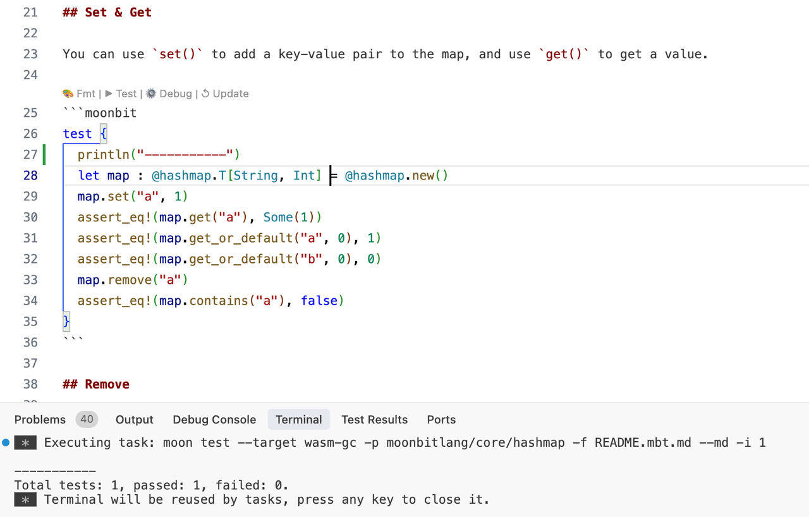
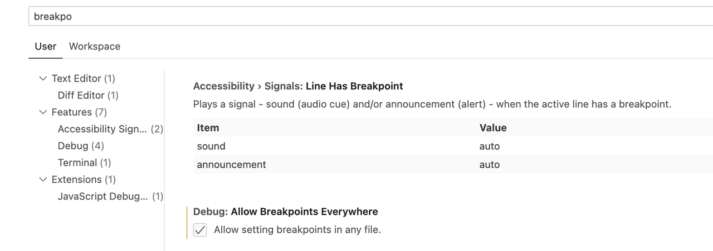

# 2025-04-07

## Language Updates

### Wasm Backend: `extern type T` Now Storable in Arrays and Data Structures

The `wasm` backend now supports storing values of `extern type T` in arrays and other data structures. At FFI boundaries (import/export function signatures), `extern type T` is still compiled to WebAssembly's `externref` type.

### C FFI Supports `borrow`

C FFI now supports the `borrow` attribute. You can use `#borrow(args, ...)` above an `extern "c"` function to customize how MoonBit manages the lifetime of certain arguments, where `args` is a subset of the C FFI function’s parameter names.

By default, MoonBit assumes C FFI functions are responsible for releasing the passed arguments. This often requires writing helper functions to manually release values.

```moonbit
fn open(path: Bytes, flags: Int, mode: Int) -> Int = "open"
```

```c
int open_wrapper(moonbit_bytes_t path, int flags, int mode) {
  int rc = open(path, flags, mode);
  moonbit_decref(path);
  return rc;
}
```

With the `borrow` attribute, you can instruct MoonBit not to generate reference counting instructions for the specified arguments, allowing direct binding to C library functions without the need for extra helper functions.

```moonbit
#borrow(path)
fn open(path: Bytes, flags: Int, mode: Int) -> Int = "open"
```

Thanks to `#borrow`, MoonBit will automatically release `path` after calling `open`.

### `type` & `trait` Support the `#deprecated` Attribute

`type` and `trait` now support the `#deprecated` attribute. In the next release, the old pragma-based mechanism will be removed. It's recommended to use the attribute instead:

```moonbit
/// the @alert pragma is deprecated
/// @alert deprecated "message"
fn f() -> Unit { ... }

/// use the #deprecated attribute instead
#deprecated("message")
fn f() -> Unit { ... }
```

### Backend Consistency Checks for Declarations of FFI `extern` Functions

Backend consistency checks have been added to declarations of FFI `extern` functions. For example, the following function will raise an error when building with non-Native backends:

```moonbit
extern "c" fn open(path: Bytes, flags: Int, mode: Int) -> Int = "open"
```

## Toolchain Updates

1. Starting this week, toolchain releases will move from Monday to Thursday.

2. Fixed a bug in the test explorer and added support for testing and debugging `.mbt.md` files:



You can enable the following setting to allow setting breakpoints inside Markdown files:
**Settings > Debug: Allow Breakpoint Everywhere**



3. `moon info --package` now supports fuzzy matching for package names.
