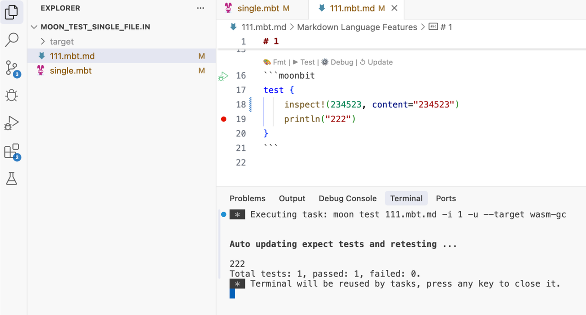

# 2025-05-19

## Language Updates

### The syntax of `x..f(..)` will be updated. In the case of `..` chaining, the last return value will automatically be discarded if it’s not used. For example, the following code:


```moonbit
impl[X : Show, Y : Show] Show for (X, Y) with output(self, logger) {
  logger
  ..write_string("(")
  ..write_object(self.0)
  ..write_string(", ")
  ..write_object(self.1)
  // Previously, omitting the final `..` could result in a type mismatch,
  // expecting `&Logger` but returning `unit`
  .write_string(")")
}
```
Can now be simplified as:

```moonbit
impl[X : Show, Y : Show] Show for (X, Y) with output(self, logger) {
  logger
  ..write_string("(")
  ..write_object(self.0)
  ..write_string(", ")
  ..write_object(self.1)
  // You can now write the full chain all the way to the end
  ..write_string(")")
```
However, if you're directly using the return value of `x..f(..)`, this behavior will be removed. You must now explicitly save the value. For example:
```moonbit
let arr = []..push(1)..push(2)
```
Must now be rewritten as:

```moonbit
let arr = []
arr..push(1)..push(2)
```


### Structs and enums now support field-level documentation comments, which will be displayed accordingly during doc generation:

```moonbit
///| Location enum
struct Location {
  /// X coordinate
  x : Int
  /// y coordinate
  y : Int
}

///| Variant enum
enum Variant {
  /// Stirng constructor
  String(String)
  /// Number constructor
  Number(Double)
}
```
### `@bytes.View` and `@string.View` will now be compiled as value types in the C and wasm1 backends.
This means that these two types will no longer involve heap allocation, leading to significantly improved memory layout and performance.

## Toolchain Updates

- vscode now supports semantic token highlighting, which distinguishes between effectful functions (such as those that throw exceptions) and normal ones, as well as async functions. This gives each usage a different visual style.

- The build system now supports the virtual package feature. By defining a package as virtual, you can specify a set of interfaces and allow users to choose actual implementations. If no implementation is provided, the system uses a default. This helps achieve clean decoupling and flexible substitution.  Note: This feature is still under development. For more details, please refer to: [Introducing virtual package in MoonBit](https://www.moonbitlang.com/blog/virtual-package)

- Now supports running test and debugging codelen directly on individual .mbt and .mbt.md files.

    